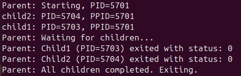
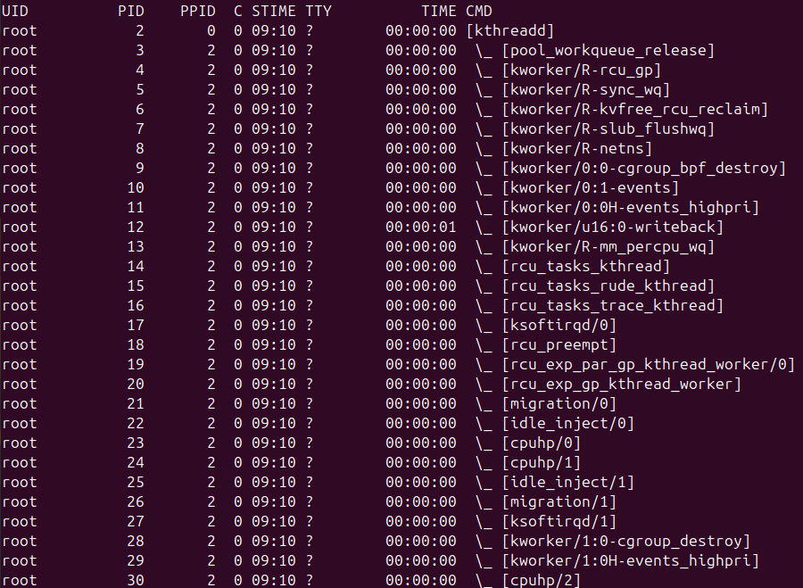
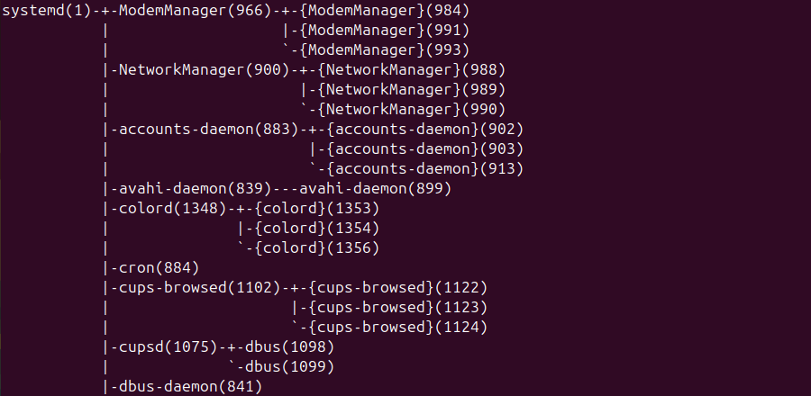
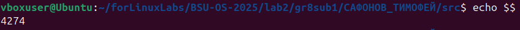
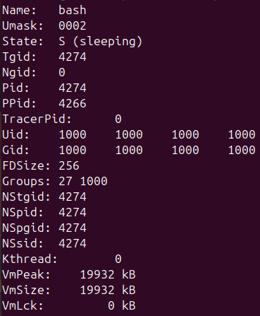
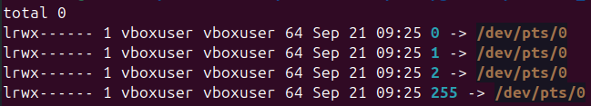
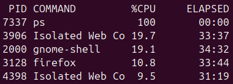
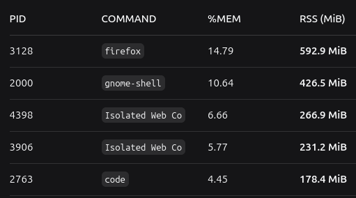
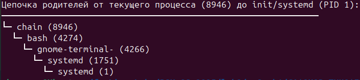

# Лабораторная 2 — Процессы и файловая система /proc
## Цель
Понять модель процессов Linux, принципы порождения и ожидания завершения, а также научиться извлекать информацию из /proc.
## Решение
### 1. Создание процессов
В папке src был созданна программа **process.c**, которая создает 1 родительский обьект и 2 дочерних. Родитель ждет свои дочерние обьекты, чтобы они успели выполниться и завершает программу, когда все обьекты выполнили свою работу. Команда компиляции:**gcc -o process process.c**. После выполнения программы было выведенно следующее:

### 2. Исследование дерева процессов
1. в bash был введен конвейер: **ps -ef --forest | head -n 30 | cat**.

Как видно из картинки, процессов моей программы нету. Это связанно с тем, что моя программа слишком быстро завершилась, а ps показывает только работающие процессы.
2. Был введен следующий конвейер: **pstree -p | head -n 50 | cat**.

Как видно из картинки, pstree показывает дерево более наглядно, когда ps показывает таблицу процессов.
### 3. Изучение /proc
1. PID оболочки:

2. Был введен следующий конвейер: **cat /proc/<pid>/cmdline | tr '\0' ' '; echo | head -n 20 /proc/<pid>/status |ls -l /proc/<pid>/fd**.
    - **cat /proc/<pid>/cmdline | tr '\0' ' '; echo**. Выводит: bash.
        Что делает: Показывает командную строку, с которой был запущен процесс.
    - **head -n 20 /proc/<pid>/status**. 
    
        Что делает: Показывает первые 20 строк из файла статуса процесса — это сжатая и читаемая сводка информации о процессе.
    - **ls -l /proc/<pid>/fd**.
    
    Что делает: Показывает список всех файловых дескрипторов (File Descriptors), которые открыты процессом в данный момент.
### 4. Анализ процессов (нагрузка CPU/память/IO)
1. TOP‑5 по CPU:

Почему они:
- ps — сама система мониторинга на мгновение заняла CPU.
- Графика (gnome-shell) — рендеринг интерфейса рабочего стола.
- Браузеры (firefox, Isolated Web Co, RDD Process) — современные браузеры — это сложные приложения, которые постоянно что-то рендерят, компилируют JavaScript, декодируют видео. Они почти всегда в топе потребления ресурсов на десктопе.
2. TOP‑5 по памяти:
 (таблица сделана при помощи нейросети deepseek).
Почему они:
- Браузер Firefox (PID 3128) — абсолютный лидер по потреблению памяти (~579 MiB). Это ожидаемо для современного браузера с открытыми вкладками.

- Графическая оболочка GNOME (PID 2000) — второй крупный потребитель (~426 MiB). Она отвечает за весь интерфейс рабочего стола.

- Процессы "Isolated Web Co" (PID 4398, 3906) — скорее всего, это процессы другого браузера (например, Chrome или Edge) или его изолированные компоненты. Вместе они используют почти 500 MiB.

- Редактор VS Code (PID 2763) — также потребляет значительный объем памяти (~178 MiB), что нормально для мощного редактора с расширениями.
3. 
- Главный потребитель CPU: Браузеры(Firefox и др.)
- Главный потребитель по памяти: Браузеры и Графика(графическая оболочка GNOME).
### 5. Мини‑утилита ptree (*)
Была создана программа **chain.c**.Команда компиляции:**gcc -o chain chain.c**. После запуска она показала:
.
## Ключевые выводы
- Изучена работа с процессами.
- Найдены самые требовательные процессы для операцинной системы.
- Изучена работа с C.
- Изучено считывание информации о процессе и нахождение этих таблиц.
## Ответы на вопросы 
1.Чем процесс отличается от программы?
 Программа — это статичный исполняемый файл на диске (например, /bin/bash). Это просто код и данные. Процесс — это экземпляр выполняющейся программы в памяти.
2. Что будет, если вызвать fork() без wait()?
- Родительский процесс продолжит работу, не зная о статусе завершения дочернего процесса.
- Дочерний процесс после завершения станет зомби (Zombie).
3. Как система хранит информацию о процессах?
Ядро Linux хранит информацию о каждом процессе в структуре task_struct. Эти структуры организованы в различные списки и деревья для эффективного планирования.
Доступ для пользователя:
- Через виртуальную файловую систему /proc (например, /proc/1234/status)
- Через системные вызовы: getpid(), getppid()
- Через утилиты: ps, top, htop
4. Что делает exec() и зачем он нужен?

exec() заменяет текущий образ процесса на новый (загружает новую программу в память и начинает её выполнение).

Зачем: Позволяет процессу запустить другую программу. Часто используется после fork(): родительский процесс остается неизменным, а дочерний с помощью exec() запускает новую программу.
5. Почему в /proc нет «настоящих» файлов?
/proc — это виртуальная файловая система (procfs). Её "файлы" не существуют на диске — они создаются ядром на лету при обращении к ним и содержат актуальную информацию о состоянии системы и процессов.
6. Как интерпретировать поля top: %CPU, %MEM, VIRT, RES, SHR, TIME+?
- %CPU-Процент времени CPU, использованного процессом за последний период обновления
- %MEM - Доля физической RAM (RSS), используемой процессом
- VIRT - Вся виртуальная память (RAM + swap + mmap'ed files)
- RES - Resident Set Size — физическая RAM, используемая прямо сейчас
- SHR - Разделяемая память (библиотеки, etc.) из RES
- TIME+ - Суммарное время CPU, использованное процессом (сотые доли секунды)
7. Почему сумма %CPU может быть больше 100%?
%CPU в top — это использование одного ядра CPU. Если процесс будет использовать более 1 ядра, то сумма будет больше 100%.
8. Чем отличается мгновенное %CPU от load average? Что означает строка Cpu(s) в top (в т.ч. wa)?
%CPU — мгновенная загрузка CPU прямо сейчас.
Load Average (1, 5, 15 мин) — усредненное количество процессов в состоянии R (running) или D (disk sleep) за период. Значение 1.0 на 1-ядерной системе означает, что CPU постоянно занят.
9. Чем IO‑нагрузка отличается от CPU‑нагрузки и как её увидеть (pidstat -d, iotop, /proc/<pid>/io)?
    CPU-нагрузка — процессы используют процессорное время.
    IO-нагрузка — процессы ждут завершения операций с диском/сетью.
Инструменты:
    pidstat -d — IO по процессам.
    iotop — аналог top для IO.
    /proc/<pid>/io — детальная IO-статистика процесса.
10. Что такое nice/приоритеты процессов и как они влияют на планирование?
    Nice value (-20 до 19) — влияет на приоритет планирования.
    Чем ближе процесс к -20, тем он важнее, чем дальше, тем менне важен.
11. Чем поток отличается от процесса и как увидеть потоки в ps/top?
Процесс — это независимая, выполняемая копия программы со своим собственным адресным пространством памяти и ресурсами, а поток — это наименьшая единица выполнения внутри процесса, которая разделяет память и ресурсы с другими потоками того же процесса
Как увидеть:
- ps -eLf — показать процессы с потоками (LWP — Light Weight Process)
- top -H — показать потоки вместо процессов
- htop — показать потоки
12. Что такое зомби и сироты, как они возникают и куда «деваются»?
Зомби (Zombie, Z) — процесс завершился, но его родитель еще не вызвал wait() для получения статуса. Ресурсы освобождены, но запись в таблице процессов остается.
Сирота (Orphan) — процесс, родитель которого завершился. Такие процессы усыновляются init/systemd (PID 1), который становится их новым родителем и вызывает wait().
Зомби исчезают, когда родитель вызывает wait() или завершается.
Сироты завершаются нормально, так как init забирает их и вызывает wait().
## Как проверяли
1. Зашел в Терминал в Ubuntu.
2. Ввел запустил программы и конвейеры, написанные выше.
3. Получил результаты.
## Как использовали AI
- Инструмент: Deepseek.
- Цель: Помощь в решении лабораторной работы.
- В чем нужна была помощь:
1. Как работать с процессами?
2. Как создать программу в С, которая создает 1 родительский обьект и 2 дочерних?
3. Почему мои процессы не отображаются в ps?
4. Как считывать таблицы про CPU и память, помощь в построении таблицы TOP-5.
5. Помощь в написании ответов на вопросы.
## Что использовалось
1. Ubuntu, version 24.04.3 LTS