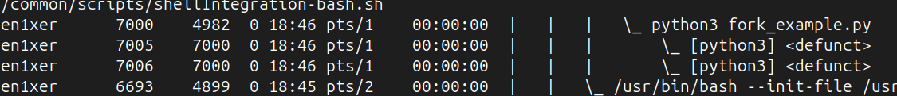
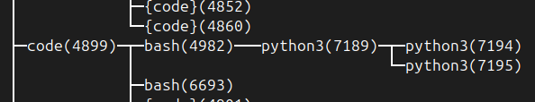

# Отчёт по исследованию процессов в Linux

---

## 2 Задание: Исследование дерева процессов

Обе команды `ps -ef --forest | head -n 30 | cat` (рис. 1.0) и `pstree -p | head -n 50 | cat` (рис. 1.1) показывают список процессов в древовидной структуре, что помогло удобнее найти наши процессы, запущенные программой ранее.

 — рис. 1.0  
 — рис. 1.1

---

## 3 Задание: изучение /proc

- Содержимое файла `cmdline` показывает полную командную строку, которой был запущен процесс.  
  Пример вывода: `bash`

- Файл `status` содержит детальную информацию о состоянии процесса в удобочитаемом формате.  
  Ключевые поля — первые 20 строк.

- Содержимое каталога `fd` отображает все открытые файловые дескрипторы процесса.

---

## 4 Задание: Анализ процессов

**TOP-5 процессов по CPU**  
Команда:  
`ps -eo pid,ppid,comm,state,%cpu,%mem,etime --sort=-%cpu | head -n 15 | cat`

| PID   | COMMAND           | %MEM | ELAPSED |
|-------|-------------------|------|---------|
| 3206  | firefox           | 4.2  | 52:12   |
| 2356  | gnome-shell       | 2.0  | 53:47   |
| 4070  | Isolated Web Co   | 3.1  | 52:05   |
| 4881  | code              | 2.0  | 51:38   |
| 4260  | Isolated Web Co   | 1.6  | 52:05   |

**TOP-5 процессов по памяти**  
Команда:  
`ps -eo pid,ppid,comm,state,%cpu,%mem,rss --sort=-%mem | head -n 15 | cat`

| PID   | COMMAND           | %MEM | RSS     |
|-------|-------------------|------|---------|
| 3206  | firefox           | 4.4  | 723380  |
| 4070  | Isolated Web Co   | 3.2  | 523228  |
| 6709  | code              | 2.3  | 378724  |
| 3697  | WebExtensions     | 2.2  | 368444  |
| 4881  | code              | 2.1  | 351276  |

**TOP-5 по I/O**  
Команда:  
`sudo iotop -b -n 5 | head -n 30 | cat`

| PID   | COMMAND           | READ (KB) | WRITE (KB) |
|-------|-------------------|-----------|------------|
| 2356  | gnome-shell       | 0.00      | 12.50      |
| 3206  | firefox           | 0.00      | 62.14      |
| 4743  | code              | 0.00      | 1.00       |
| 4836  | code              | 0.00      | 3.00       |
| 4070  | Isolated Web Co   | 0.00      | 0.00       |

**Вывод:**  
Особой нагрузки нет, так как ничего не выполняется.

Самые нагружаемые процессы:
1. **Firefox** — браузер с открытыми вкладками, нагружает CPU, требует немного памяти, активно пишет данные.
2. **Isolated Web Co** — процессы, связанные с веб-контентом и расширениями (AdGuard, VPN).
3. **Code** — редактор кода. Умеренная нагрузка по CPU и I/O, постоянно сохраняет данные.
4. **Gnome-shell** — графическая оболочка.

---

## Ответы на вопросы

### Чем процесс отличается от программы
Программа — это статический набор инструкций, хранящийся на диске.  
Процесс — это активное выполнение программы, с собственным PID, адресным пространством и состоянием.

---

### Что будет, если вызвать fork() без wait()
Родитель не будет ждать завершения дочернего процесса.  
Если дочерний завершится раньше, он станет зомби до вызова `wait()`.  
Массовое использование `fork()` без `wait()` может переполнить таблицу процессов.

---

### Как система хранит информацию о процессах
В ядре — через структуру `task_struct`.  
В пользовательском пространстве — через виртуальную файловую систему `/proc`, где каждый процесс представлен каталогом `/proc/<PID>`.

---

### Что делает exec() и зачем он нужен
`exec()` заменяет текущий образ процесса новым, загружая другую программу.  
PID остаётся, но код, данные и стек — обновляются.  
Применяется после `fork()` для запуска другой программы в дочернем процессе.

---

### Почему в /proc нет «настоящих» файлов
`/proc` — это виртуальная файловая система.  
Файлы не хранятся на диске, а генерируются ядром в реальном времени, отражая текущее состояние системы и процессов.

---

### Как интерпретировать поля top: %CPU, %MEM, VIRT, RES, SHR, TIME+
- `%CPU` — процент использования CPU процессом  
- `%MEM` — процент использования оперативной памяти  
- `VIRT` — объём виртуальной памяти (включая swap и mmap)  
- `RES` — реально используемая физическая память  
- `SHR` — объём разделяемой памяти  
- `TIME+` — суммарное процессорное время процесса

---

### Почему сумма %CPU может быть больше 100%
На многоядерных системах каждое ядро считается за 100%.  
Если процесс использует два ядра на 100%, его `%CPU` будет 200%.  
Это отражает суммарную загрузку всех ядер.

---

### Чем отличается мгновенное %CPU от load average. Что означает строка Cpu(s) в top (в т.ч. wa)
- `%CPU` — мгновенное использование CPU конкретным процессом  
- `load average` — средняя нагрузка за 1, 5 и 15 минут (кол-во процессов в очереди)  
- Строка `Cpu(s)`:
  - `us` — пользовательские процессы  
  - `sy` — системные процессы  
  - `ni` — процессы с изменённым приоритетом  
  - `id` — простаивающее время  
  - `wa` — ожидание завершения операций ввода-вывода  
  - `hi/si` — аппаратные и программные прерывания  
  - `st` — украденное время (в виртуалках)

---

### Чем IO‑нагрузка отличается от CPU‑нагрузки и как её увидеть
- CPU‑нагрузка — использование процессора для вычислений  
- IO‑нагрузка — операции чтения/записи на диск или в сеть  
- Инструменты:
  - `pidstat -d` — показывает IO по PID  
  - `iotop` — интерактивный монитор ввода-вывода  
  - `/proc/<PID>/io` — детальная статистика IO процесса

---

### Что такое nice/приоритеты процессов и как они влияют на планирование
- `nice` — значение от -20 (высший приоритет) до 19 (низший)  
- Чем ниже `nice`, тем выше приоритет процесса  
- Влияет на то, как часто процесс получает доступ к CPU

---

### Чем поток отличается от процесса и как увидеть потоки в ps/top
- Поток — легковесная единица выполнения внутри процесса, разделяет память и ресурсы  
- Процесс — самостоятельная единица с изолированным адресным пространством  
- В `ps`: `ps -eLf` или `ps -T`  
- В `top`: нажать `H` для отображения потоков

---

### Что такое зомби и сироты, как они возникают и куда «деваются»
- **Зомби** — завершившиеся процессы, чьи записи ещё не удалены, так как родитель не вызвал `wait()`  
- **Сироты** — процессы, чьи родители завершились  
- Сироты усыновляются процессом `init` (PID 1)  
- Зомби исчезают после вызова `wait()` или после завершения родителя
