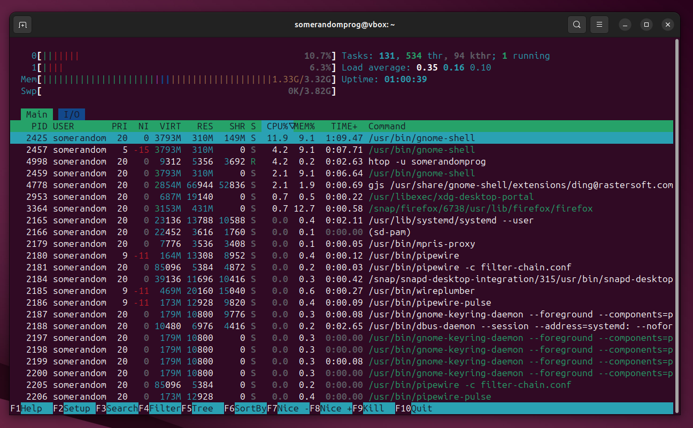

# лабораторная 2 - процессы и файловая система /proc

## окружение

```
Ubuntu 25.04 (VirtualBox)
GNU bash, версия 5.2.37(1)-release
Python 3.13.3
```

## цель работы

изучить организацию процессов в системе linux — как их создавать (fork, exec), кто ими управляет, как за ними наблюдать через /proc.

## задача 1 - порождатель процессов

написан скрипт на python, который создаёт два дочерних процесса, и удерживает родителя до нажатия enter, чтобы его можно было найти в дальнейших заданиях:

```py
import os
import sys

print(f"parent: PID={os.getpid()}, PPID={os.getppid()}")
for i in range(2):
	pid = os.fork()
	if pid == 0:
        # ...child...
		print(f"child[{i}]: PID={os.getpid()}, PPID={os.getppid()}")
		sys.exit(0)
	else:
        # ...parent...
		os.waitpid(pid, 0)	

input("press enter to exit...")
```

вывод программы (`python src/fork.py`):

```
parent: PID=5447, PPID=3141
child[0]: PID=5448, PPID=5447
child[1]: PID=5449, PPID=5447
press enter to exit...
```

## задача 2 - поиск родителя

pid процесса скрипта `fork.py` - `5547`. найдём его через утилиты `ps` и `pstree`:

`ps -ef --forest | grep -C 3 '5547' | cat`:

```
(username) (pid!)  (ppid)
someran+    3064    2764  0 10:49 pts/4    00:00:00      \_ bash
someran+    3095    2764  0 10:50 pts/5    00:00:00      \_ bash
someran+    3141    2764  0 10:55 pts/6    00:00:00      \_ bash
someran+    5447    3141  0 12:04 pts/6    00:00:00      |   \_ python fork.py
someran+    3153    2764  0 10:55 pts/7    00:00:00      \_ bash
someran+    5451    2764  3 12:04 pts/8    00:00:00      \_ bash
someran+    5462    5451 99 12:04 pts/8    00:00:00          \_ ps -ef --forest
someran+    5463    5451  0 12:04 pts/8    00:00:00          \_ grep --color=auto -C 3 5447
someran+    5464    5451  0 12:04 pts/8    00:00:00          \_ cat
rtkit       1736       1  0 10:40 ?        00:00:00 /usr/libexec/rtkit-daemon
colord      2047       1  0 10:41 ?        00:00:00 /usr/libexec/colord
```

`pstree -p | grep -C 3 '5547' | cat`:

```
(здесь обрезано, но над bash ещё идёт gnome-terminal)
           |               |                       |-bash(3025)
           |               |                       |-bash(3064)
           |               |                       |-bash(3095)
           |               |                       |-bash(3141)---python(5447)
           |               |                       |-bash(3153)
           |               |                       |-bash(5451)-+-cat(5497)
           |               |                       |            |-grep(5496)
```

## задача 3 - виртуальная папка `/proc`

узнаём pid текущего терминала через `echo $$` -> `5638`.

### `cat /proc/5638/cmdline | tr '\0' ' '; echo`

выведет то, как вызывалась программа. например, если вызывался скрипт `abc.py`, то для интерпретатора питона данная команда выведет `python abc.py`. в нашем случае:

```
bash
```

т.е. мы просто открыли новый терминал bash.

### `head -n 20 /proc/5638/status`

файл `status` содержит информацию о процессе, включая его название, состояние, pid, ppid (pid родительского процесса), и т.д. в нашем случае:

```
Name:	bash
Umask:	0002
State:	S (sleeping)
Tgid:	5638
Ngid:	0
Pid:	5638
PPid:	2764
TracerPid:	0
Uid:	1000	1000	1000	1000
Gid:	1000	1000	1000	1000
FDSize:	256
Groups:	4 24 27 30 46 100 115 1000 
NStgid:	5638
NSpid:	5638
NSpgid:	5638
NSsid:	5638
Kthread:	0
VmPeak:	   20948 kB
VmSize:	   20948 kB
VmLck:	       0 kB
```

### `ls -l /proc/5638/fd`

файл `fd` содержит информацию о файловых дескрипторах (file descriptors - fd), используемых процессом. в нашем случае:

```
total 0
lrwx------ 1 somerandomprog somerandomprog 64 Sep 19 12:28 0 -> /dev/pts/8
lrwx------ 1 somerandomprog somerandomprog 64 Sep 19 12:28 1 -> /dev/pts/8
lrwx------ 1 somerandomprog somerandomprog 64 Sep 19 12:28 2 -> /dev/pts/8
lrwx------ 1 somerandomprog somerandomprog 64 Sep 19 12:28 255 -> /dev/pts/8
```

- `0` - входной поток (`/dev/stdin`)
- `1` - выходной поток (`/dev/stdout`)
- `2` - выходной поток для ошибок (`/dev/stderr`)
- `255` - альтернативный поток, который используется при блокировке stdout или stderr.

т.к. программа не открывала каких-либо файлов, соответственно новые дескрипторы не создавались, из-за чего команда выводит `total 0` (дескрипторы `0`, `1`, `2`, `255` создаются автоматически для каждого процесса). все встроенные дескрипторы перенаправлены на `/dev/pts/8` - псевдо-терминал, используемый в эмуляторах терминалов, по типу `gnome-terminal`.

## задача 4 - анализ процессов

### по процессору

проанализировав вывод команды `ps -eo pid,ppid,comm,state,%cpu,%mem,etime --sort=-%cpu | head -n 15 | cat`, создадим топ-5 тяжёлых процессов по нагрузке на процессор:

| pid  | команда             | %cpu | время работы (etime) |
| ---- | ------------------- | ---- | -------------------- |
| 2425 | gnome-shell         | 15.1 | 01:39                |
| 3248 | firefox             | 15.1 | 00:53                |
| 2737 | ibus-extension-gtk3 | 6.0  | 01:36                |
| 1    | systemd             | 2.4  | 02:17                |
| 3223 | gnome-terminal      | 2.4  | 01:02                |

самые затратные процессы - те, которые используют много графических и/или интерактивных элементов (браузер, оболочка GNOME). дальше идут главный процесс системы `systemd`, а также различные графические программы, запущенные в оболочке GNOME.

### по памяти

посмотрим на вывод команды `ps -eo pid,ppid,comm,state,%cpu,%mem,rss --sort=-%mem | head -n 15 | cat`:

| pid  | команда           | %mem | используемая память (rss) |
| ---- | ----------------- | ---- | ------------------------- |
| 3248 | firefox           | 12.8 | 438mb                     |
| 2425 | gnome-shell       | 8.7  | 298mb                     |
| 3448 | Privileged Cont   | 3.5  | 120mb                     |
| 2985 | mutter-x11-frames | 2.7  | 95mb                      |
| 3795 | WebExtensions     | 2.7  | 94mb                      |

3/5 процессов занимает браузер firefox - `Privileged Cont` (защищённый контейнер, предоставляемый `snap`) и `WebExtensions` (отдельный процесс для веб-расширений) тоже относятся к нему. остальные 2 процесса относятся к оболочке GNOME, что в принципе неудивительно, т.к. она является одной из самых ресурсозатратных и красивых оболочек по сравнению с другими.

### по i/o

на моей виртуальной машине в момент выполнения команд не было высокой нагрузки по i/o, т.к. был запущен только терминал и браузер, поэтому iotop выдал список процессов, `rKB/s` и `wKB/s` которых везде равнялся нулю.

### как выглядит `htop`



## задача 5 - утилита `ptree`

написана утилина на python, которая отображает "путь" от текущего процесса до самого главного (`init`):

```py
import os

pid = os.getpid()
# цикл прекратится, когда дойдёт очередь до systemd, у которого ppid = 0.
while pid != 0:
	ppid = None
	name = None
    # читаем файлик с информацией о процессе
	with open(f'/proc/{pid}/status', 'r') as f:
		for line in f:
            # если нашли ppid
			if line.startswith("PPid"):
				ppid = int(line.split("\t")[1])
            # если нашли название процесса
			elif line.startswith("Name"):
				name = line.split("\t")[1].replace("\n", "")

    # выводим название и pid
	print(f"{name}({pid})", end='')
    # если есть родитель, то продолжаем цепочку
	if ppid != 0:
		print(" ← ", end='')
	pid = ppid
print()
```

вывод выглядит следующим образом (`python ptree.py`):

`python(5715) ← bash(3235) ← gnome-terminal-(3223) ← systemd(2165) ← systemd(1)`

## вопросы

- **чем отличается процесс от программы?**
  
    > программа - набор инструкций, хранящийся на диске или любом другом носителе информации. процесс - экземпляр выполнения этих инструкций.

- **что будет, если вызвать `fork()` без `wait()`?**

    > дочерний процесс либо станет сиротой (если родительский процесс завершится раньше дочернего), либо зомби (т.е. он уже не выполняется, но висит в списке процессов, т.к. ожидает код завершения или других команд).

- **как система хранит информацию о процессах?**
  
    > ядро создаёт специальную виртуальную файловую систему `/proc` (т.е. файлы и папки генерируются ядром по надобности), в которой лежат различные файлы по типу `status`, `exe`, `fd`, благодаря которым можно узнать информацию о любом процессе.

- **что делает `exec()` и зачем он нужен?**

    > в отличие от `fork()`, `exec()` заменяет текущий процесс новой программой. он не меняет PID, но начинает выполнять другой код.

- **почему в `/proc` нет "настоящих файлов"?**

    > в этом нет необходимости. в отличие от Windows, в POSIX системах концепция "виртуальных" файловых систем встречается намного чаще и не без причины - это менее ресурсозатратно и не требует реального общения с жёсткими дисками, однако предоставляет те же удобства, что и чтение файлов (вместо WinAPI, где для чтения информации имеется миллион различных функций).

- **как интерпретировать поля `top`: `%CPU`, `%MEM`, `VIRT`, `RES`, `SHR`, `TIME+`?**

    > - `%CPU` - "доля" процессора, используемая процессом (сколько тактов он занимает для обновления).
    > - `%MEM` - доля *физической* оперативной памяти, занимаемая процессом.
    > - `VIRT` - доля *виртуальной* памяти (код, библиотеки, т.д.), занимаемая процессом.
    > - `RES` - объём физической оперативной памяти, занимаемый процессом (без файла подкачки).
    > - `SHR` - объём памяти, который можно было бы (или можно будет) поделить между процессами в случае нехватки оперативной памяти.
    > - `TIME+` - время, которое отнимает процесс от процессора для обновления (с точностью до миллисекунды).

- **почему сумма `%CPU` может быть больше 100%?**

    > в POSIX системах доля процессора считается по-другому, нежели в Windows. если в процессоре есть несколько ядер, скажем, 4, то **каждое ядро** даёт вклад 100%, в сумме получая 400%. на практике это полезнее, т.к. таким образом можно отслеживать нагрузку на каждое отдельное ядро при выполнении ресурсозатратных программ.

- **чем отличается мгновенное `%CPU` от `load average`? Что означает строка `Cpu(s)` в `top` (в т.ч. `wa`)?**

    > `%CPU` показывает мгновенную нагрузку на процессор процессом (т.е. в текущий момент), в то время как `load average` показывает среднюю нагрузку на процессор на протяжении нескольких промежутков времени. строка `Cpu(s)` содержит следующие показатели:
        
    > - `us` - процессорное время, используемое процессами.
    > - `sy` - процессорное время, используемое ядром.
    > - `ni` - процессорное время, используемое процессами с определённым приоритетом (`nice`).
    > - `id` - время простоя (idle).
    > - `wa` - процессорное время, потраченное на ожидание завершения i/o операций (т.к. процессор работает *в миллионы раз* быстрее, чем, например, жёсткий диск)
    >   - `hi` - процессорное время, потраченное на обработку аппаратных прерываний.
    >   - `si` - процессорное время, потраченное на обработку программных прерываний.
    >   - `st` - процессорное время, украденное виртуальной машиной (гипервизором).

- **чем IO‑нагрузка отличается от CPU‑нагрузки и как её увидеть?**

    > CPU-нагрузкой считается время, когда процессор что-то активно вычисляет, а IO-нагрузкой - когда он ждёт завершения i/o операций (чтение с диска, передача по сети, т.д.). посмотреть i/o нагрузку можно при команд `top` (строка `wa`), `pidstat -d` (для дисковых операций), `iotop` (тоже для дисковых операций) и `cat /proc/<pid>/io` (выводит общее кол-во байт, прочитанных и записанных процессом).

- **что такое `nice`/приоритеты процессов и как они влияют на планирование?**

    > `nice` - значение "вежливости" процесса, определяющее его приоритет, т.е. сколько ресурсов ему стоит уделять. значения `nice` разнятся от `-20` до `19`: чем меньше значение, тем более процесс "жадный" и требующий внимания. обычные пользователи могут только *повышать* значение `nice`.

- **чем поток отличается от процесса и как увидеть потоки в `ps`/`top?`**

    > *процесс* - изолированная единица планировщика, т.е. он имеет свой кусочек памяти, диска, т.д.
    >
    > *поток* - единица выполнения **внутри** процесса, т.е. потоки разделяют между собой одну память, но выполняют различный код. каждый поток имеет свой `tid` (thread id) который можно найти через функцию `getpid()` или, например, через команду `ps -eLf` (в графе `lwp`) или `top -H` (будет показывать все потоки вместо процессов).

- **что такое зомби и сироты, как они возникают и куда «деваются»?**

    > *сирота* - процесс, чей родительский процесс завершился раньше чем он сам. такие процессы усыновляются `init`, который через определённый момент завершит его.
    >
    > *зомби* - процесс, который уже завершился, но родительский процесс этого не зарегистрировал (например, не вызвал `wait()`). он уже не выполняется, но занимает место в списке процессов и завершится только тогда, когда родительский процесс вызовет `wait()` или же завершится сам (в случае чего дочерний процесс станет сиротой).

## вывод

я познакомился с тем, как устроена иерархия процессов в системе linux: изучил новые команды, поработал с виртуальной файловой системой `/proc`, написал небольшие утилиты с применением функций из posix.