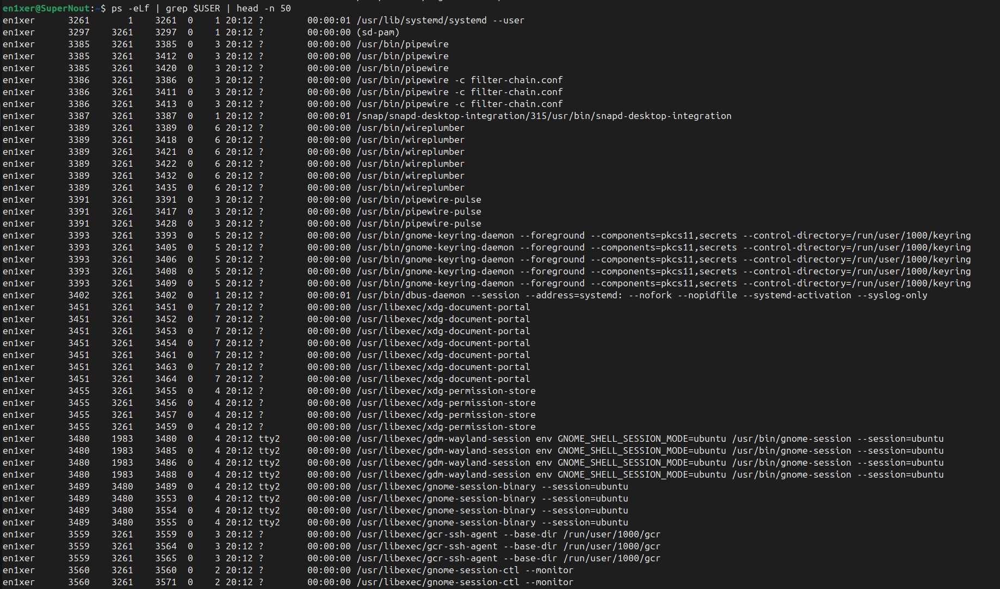

Задание 1:
Цель:
Целью работы является демонстрация проблемы гонки данных при параллельном доступе к общей переменной, а также исследование способов её устранения. Реализована многопоточная программа, в которой N потоков суммарно выполняют M инкрементов общего счётчика. Предусмотрены три режима работы:

    Без синхронизации (unsync) — для демонстрации некорректного результата.

    С использованием мьютекса (mutex) — для корректного результата с блокировкой.

    С использованием атомарных операций (atomic) — для корректного результата без блокировок.

Описание реализации:
Программа принимает три аргумента: количество потоков (N), общее число инкрементов (M) и режим синхронизации. Каждый поток выполняет M/N инкрементов. Время выполнения измеряется с помощью clock_gettime(CLOCK_MONOTONIC).

В режиме unsync используется обычный counter++, что приводит к гонке данных. В режиме mutex используется pthread_mutex_lock и pthread_mutex_unlock для защиты доступа к счётчику. В режиме atomic используется atomic_fetch_add из stdatomic.h.

Результаты эксперементов:
Результаты эксперементов можно подробно увидеть в файле threads_result.txt полсле запуска скрипта benchmark_threads.sh, который запускает серию тестов с разным количетсвом потоко ( от 2 до 64), разным количеством итераций (от 10 до 10000000) и в разных режимах синхронизации или менее подробно в табличке снизу. 

В режиме unsync наблюдаются потери инкрементов при увеличении числа потоков, что подтверждает наличие гонки данных. В режимах mutex и atomic результат всегда совпадает с ожидаемым, но время выполнения различается.

Режим mutex обеспечивает корректность, но при большом числе потоков приводит к росту времени выполнения из-за блокировок. Режим atomic также обеспечивает корректность, но работает быстрее, особенно при высокой степени параллелизма.

+---------+---------+-------------+----------+--------+-----------+
| Mode    | Threads | Iterations  | Expected | Actual | Elapsed   |
+---------+---------+-------------+----------+--------+-----------+
| unsync  |   16    |      10     |    10    |    0   | 0.00096 s |
+---------+---------+-------------+----------+--------+-----------+
| unsync  |   64    |     100     |   100    |   64   | 0.00455 s |
+---------+---------+-------------+----------+--------+-----------+
| unsync  |   64    |     1000    |   1000   |  960   | 0.00629 s |
+---------+---------+-------------+----------+--------+-----------+
| unsync  |   32    |    10000    |  10000   |  9984  | 0.00217 s |
+---------+---------+-------------+----------+--------+-----------+
| unsync  |   64    |   100000    | 100000   | 99968  | 0.00348 s |
+---------+---------+-------------+----------+--------+-----------+
| mutex   |    2    |  10000000   | 10000000 |10000000| 1.58557 s |
+---------+---------+-------------+----------+--------+-----------+
| mutex   |    4    |  10000000   | 10000000 |10000000| 2.32121 s |
+---------+---------+-------------+----------+--------+-----------+
| mutex   |    8    |  10000000   | 10000000 |10000000| 2.83827 s |
+---------+---------+-------------+----------+--------+-----------+
| mutex   |   16    |  10000000   | 10000000 |10000000| 2.97141 s |
+---------+---------+-------------+----------+--------+-----------+
| mutex   |   32    |  10000000   | 10000000 |10000000| 2.99237 s |
+---------+---------+-------------+----------+--------+-----------+
| mutex   |   64    |  10000000   | 10000000 |10000000| 2.89510 s |
+---------+---------+-------------+----------+--------+-----------+
| atomic  |    2    |  10000000   | 10000000 |10000000| 0.38091 s |
+---------+---------+-------------+----------+--------+-----------+
| atomic  |    4    |  10000000   | 10000000 |10000000| 0.48808 s |
+---------+---------+-------------+----------+--------+-----------+
| atomic  |    8    |  10000000   | 10000000 |10000000| 0.52685 s |
+---------+---------+-------------+----------+--------+-----------+
| atomic  |   16    |  10000000   | 10000000 |10000000| 0.55905 s |
+---------+---------+-------------+----------+--------+-----------+
| atomic  |   32    |  10000000   | 10000000 |10000000| 0.60316 s |
+---------+---------+-------------+----------+--------+-----------+
| atomic  |   64    |  10000000   | 10000000 |10000000| 0.67643 s |
+---------+---------+-------------+----------+--------+-----------+
| mutex   |    2    |   1000000   | 1000000  | 1000000| 0.20745 s |
+---------+---------+-------------+----------+--------+-----------+
| atomic  |    2    |   1000000   | 1000000  | 1000000| 0.03728 s |
+---------+---------+-------------+----------+--------+-----------+
| unsync  |    2    |  10000000   | 10000000 |10000000| 0.00025 s |
+---------+---------+-------------+----------+--------+-----------+

Выводы:

Гонка данных — это реальная угроза при параллельной работе с общей переменной. Её можно устранить с помощью синхронизации. Использование мьютексов гарантирует корректность, но может снижать производительность. Атомарные операции позволяют сохранить корректность и при этом обеспечить лучшую масштабируемость. Выбор метода синхронизации зависит от требований к точности и производительности.

Задание 2:

Цель работы
Целью было реализовать многопоточную модель взаимодействия «производитель–потребитель» на языке C с использованием POSIX Threads. Основная задача заключалась в том, чтобы несколько потоков‑производителей могли безопасно помещать данные в общий буфер, а несколько потоков‑потребителей — извлекать их, при этом гарантируя отсутствие гонок данных и корректное завершение работы всех потоков.

Реализация
В качестве общей структуры данных используется кольцевой буфер ring_buffer_t. Он хранит массив элементов, индексы головы и хвоста, счётчик текущего количества элементов, а также мьютекс и две условные переменные. Производители вызывают функцию rb_push, которая помещает элемент в буфер и при необходимости ждёт освобождения места. Потребители используют функцию rb_pop, которая извлекает элемент и при необходимости ждёт появления данных. Когда последний производитель завершает работу, он вызывает rb_producer_done, уменьшая счётчик активных производителей и пробуждая всех ожидающих потребителей.

Каждый поток‑производитель получает количество элементов для генерации и кладёт их в буфер. Каждый поток‑потребитель извлекает данные до тех пор, пока буфер не опустеет и все производители не завершат работу. В конце программа подсчитывает общее количество произведённых и потреблённых элементов, а также контрольную сумму.

Запуск программы
Программа принимает параметры командной строки:
    -P — количество производителей,
    -C — количество потребителей,
    -N — общее количество элементов,
    -B — размер буфера.

Запуск возможен двумя способами:

    Непосредственно через компиляцию и вызов бинарника:
    gcc -pthread -o prodcons prodcons.c
    ./prodcons -P 2 -C 2 -N 100000 -B 64

    С помощью скрипта benchmark_prodcons.sh, который автоматически выполняет серию тестов с разными параметрами и сохраняет результаты в файл prodcons_result.txt. Это позволяет проверить работу программы в разных сценариях нагрузки.

Результаты
    ./prodcons -P 2 -C 2 -N 100000 -B 64
Вывод:
    Result: P=2 C=2 N=100000 B=64 produced=100000 consumed=100000 sum=5000050000
Видно, что количество произведённых элементов совпадает с количеством потреблённых, а контрольная сумма подтверждает целостность данных. При запуске с другими параметрами через скрипт также наблюдается совпадение произведённых и потреблённых значений.

Выводы
Программа корректно реализует модель «производитель–потребитель» с использованием POSIX Threads. Синхронизация через мьютексы и условные переменные обеспечивает безопасный доступ к буферу и предотвращает гонки данных. Проверка статистики подтверждает правильность работы: количество произведённых элементов совпадает с количеством потреблённых. Решение масштабируется по числу потоков и размеру буфера, что позволяет моделировать различные сценарии нагрузки.

3 Задание:
    Команда:
    ps -L -p 4358 -o pid,tid,psr,pcpu,stat,comm | head -n 20 | cat
    Вывод:
    PID     TID PSR %CPU STAT COMMAND
    4358    4358   7  0.0 Ss   bash

    Команда:
    ps -eLf | grep $USER | head -n 50
    Вывод:
    
    Пояснения:
    systemd + PAM — управление сессией,
    PipeWire + WirePlumber — звук и мультимедиа,
    Keyring + gcr — хранение секретов,
    D‑Bus + XDG‑порталы — IPC и безопасность,
    GNOME‑сессия — графическая оболочка и файловые сервисы.

