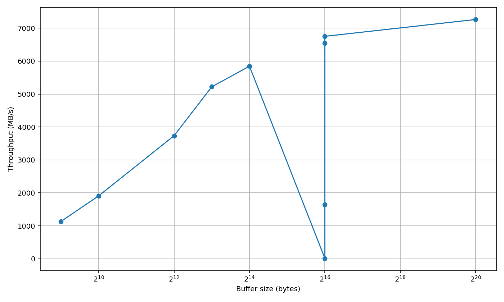
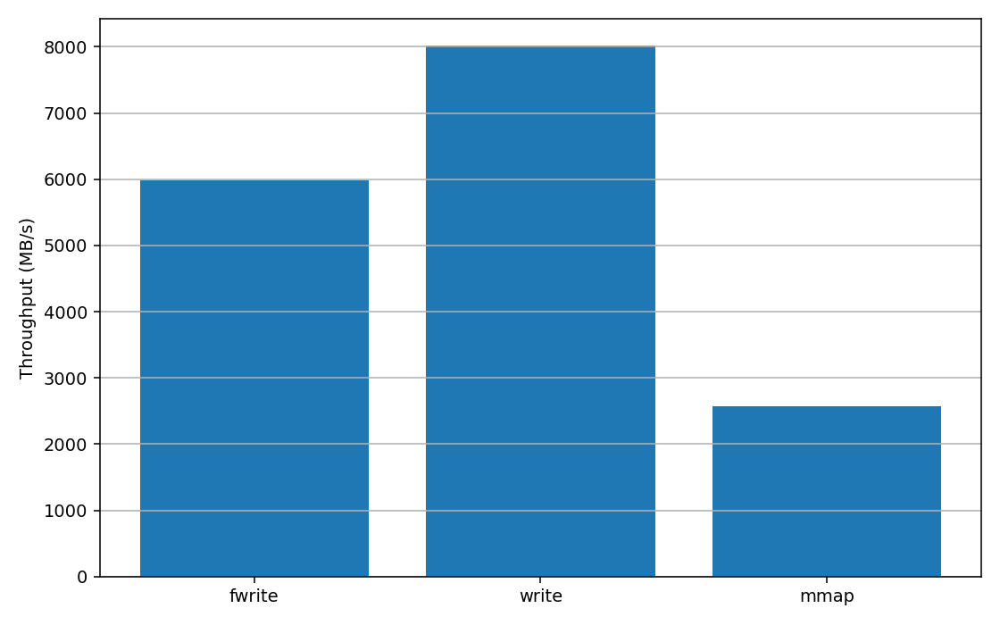

# Лабораторная 4 - Управление памятью и файловый ввод-вывод

Практика по управлению памятью в Linux: изучим виртуальную память процессов, страничную организацию, page faults, memory mapping, файловый ввод-вывод и буферизацию. Реализуем утилиту для профилирования памяти процессов.

### Цели работы:

- Понять, как ОС управляет виртуальной памятью
- Изучить механизмы page fault, demand paging, CoW
- Сравнить производительность stdio и системных вызовов
- Освоить мониторинг I/O через /proc, iostat, iotop
- Реализовать утилиту профилирования памяти

## Ход работы (Вариант 2)
### Подготовка
Скопируем нужные семплы себе в `src` следующей командой:
```bash
mkdir -p "gr8sub2/СТРЕМУЖЕВСКИЙ_ДЕНИС/src" && cp -v samples/{Makefile,io_benchmark.c,memory_info.c,memory_profiler.c} "gr8sub2/СТРЕМУЖЕВСКИЙ_ДЕНИС/src"
```

## Задание A
Релизуем все TODO в `src/memory_info.c`.

Соберем программу 
```bash
gcc -Wall -Wextra -O2 memory_info.c -o memory_info
```
Запустим и сравним вывод с системными утилитами
```bash
./memory_info </dev/null & PID=$! ps -o pid,vsz,rss -p $PID cat /proc/$PID/status | grep ^Vm
```
Вывод: 
```
[4] 131706
Memory Info Demo
================

No PID specified. Running demonstration mode.
This will allocate different types of memory and show the results.


=== Demonstrating Different Memory Types ===

1. Stack variable allocated: 1 KB at 0x7ffd53d80300
    PID    VSZ   RSS
 131706  12948  9840
2. Heap allocated & touched: 10 MB at 0x7ffa251ff010
VmPeak:    64148 kB
VmSize:    64148 kB
VmLck:         0 kB
VmPin:         0 kB
VmHWM:     20080 kB
VmRSS:     20080 kB
VmData:    61648 kB
VmStk:       132 kB
VmExe:         4 kB
VmLib:      1656 kB
VmPTE:        80 kB
VmSwap:        0 kB
3. Anonymous mmap (touched): 50 MB at 0x7ffa21e00000                                                                                                                                                                          

Memory allocated. Check /proc/131706/maps.
Press Enter to see memory info and map...
Memory Metrics for PID 131706:
  VSZ (Virtual):  64148 KB (62.6 MB)
  RSS (Resident): 63156 KB (61.7 MB)
  Data/Heap:      61648 KB (60.2 MB)
  Stack:          132 KB (0.1 MB)

Memory Map:
Address Range      Perms  Size     Path
----------------------------------------------------------------
55910882e000-55910882f000 r--p        4KB  /home/wresq/BSU-OS-2025/lab4/gr8sub2/СТРЕМУЖЕВСКИЙ_ДЕНИС/src/memory_info
55910882f000-559108830000 r-xp        4KB  /home/wresq/BSU-OS-2025/lab4/gr8sub2/СТРЕМУЖЕВСКИЙ_ДЕНИС/src/memory_info
559108830000-559108831000 r--p        4KB  /home/wresq/BSU-OS-2025/lab4/gr8sub2/СТРЕМУЖЕВСКИЙ_ДЕНИС/src/memory_info
559108831000-559108832000 r--p        4KB  /home/wresq/BSU-OS-2025/lab4/gr8sub2/СТРЕМУЖЕВСКИЙ_ДЕНИС/src/memory_info
559108832000-559108833000 rw-p        4KB  /home/wresq/BSU-OS-2025/lab4/gr8sub2/СТРЕМУЖЕВСКИЙ_ДЕНИС/src/memory_info
5591207df000-559120800000 rw-p      132KB  [heap]
7ffa21e00000-7ffa25000000 rw-p    51200KB  (anonymous)
7ffa251ff000-7ffa25c00000 rw-p    10244KB  (anonymous)
7ffa25c00000-7ffa25c24000 r--p      144KB  /usr/lib/libc.so.6
7ffa25c24000-7ffa25d96000 r-xp     1480KB  /usr/lib/libc.so.6
7ffa25d96000-7ffa25e05000 r--p      444KB  /usr/lib/libc.so.6
7ffa25e05000-7ffa25e09000 r--p       16KB  /usr/lib/libc.so.6
7ffa25e09000-7ffa25e0b000 rw-p        8KB  /usr/lib/libc.so.6
7ffa25e0b000-7ffa25e13000 rw-p       32KB  (anonymous)
7ffa25f23000-7ffa25f28000 rw-p       20KB  (anonymous)
7ffa25f52000-7ffa25f56000 r--p       16KB  [vvar]
7ffa25f56000-7ffa25f58000 r--p        8KB  [vvar_vclock]
7ffa25f58000-7ffa25f5a000 r-xp        8KB  [vdso]
7ffa25f5a000-7ffa25f5b000 r--p        4KB  /usr/lib/ld-linux-x86-64.so.2
7ffa25f5b000-7ffa25f85000 r-xp      168KB  /usr/lib/ld-linux-x86-64.so.2
7ffa25f85000-7ffa25f93000 r--p       56KB  /usr/lib/ld-linux-x86-64.so.2
7ffa25f93000-7ffa25f95000 r--p        8KB  /usr/lib/ld-linux-x86-64.so.2
7ffa25f95000-7ffa25f96000 rw-p        4KB  /usr/lib/ld-linux-x86-64.so.2
7ffa25f96000-7ffa25f97000 rw-p        4KB  (anonymous)
7ffd53d61000-7ffd53d82000 rw-p      132KB  [stack]
ffffffffff600000-ffffffffff601000 --xp        4KB  [vsyscall]

Press Enter to free memory and exit...
[4]    131706 done       ./memory_info < /dev/null Вот какой вывод, проанализируй его, ответь на  Почему VSZ больше RSS?
```
### Анализ :
- После только стека `PID 131706  VSZ=12948 KB  RSS=9840 KB`, потчи нет аллокаций
- После malloc 10 MB + touch `VmSize=64148 KB, VmRSS=20080 KB, VmData=61648 KB`, появляется ~20MB RSS, это minor page faults при first touch страниц из 10MB- блока и служебные накладные.
- После anon mmap 50 MB + touch `VSZ ≈ 62.6 MB, RSS ≈ 61.7 MB, Data/Heap ≈ 60.2 MB`, после обоих блоков RSS почти догнал VSZ
- Карта памяти подтверждает:
- - `[heap]` всего ~132 KB, но есть две большие анонимные области:

        ```
        7ffa21e00000-7ffa25000000 rw-p  51200KB  (anonymous)   <-- ~50 MB
        7ffa251ff000-7ffa25c00000 rw-p  10244KB  (anonymous)   <-- ~10 MB (крупный malloc)
        ```
  - Большие malloc в glibc идут через mmap, поэтому классический `[heap]` остаётся маленьким - это ожидаемо.
  - `[stack]` ~132 KB у верхних адресов, `[vdso]/[vvar]/[vsyscall]` - служебные сегменты ядра.

### Ответы на вопросы:
1. Почему VSZ больше RSS?
- VSZ (VmSize) - суммарное виртуальное адресное пространство: код, данные, библиотеки, все `mmap` (включая ещё не тронутые страницы), guard-страницы и т.п.

- RSS (VmRSS) - только страницы, реально находящиеся в RAM сейчас.  
  Пока страницы не тронуты, VSZ уже большой, а RSS маленький. После touch появляются minor page faults, страницы попадают в RAM и RSS растёт. В финальном снимке RSS почти догнал VSZ, потому что прошли по всем страницам 10 MB и 50 MB.

2. Где находятся stack, heap, mmap в адресном пространстве?
- `[stack]`: вверху адресного пространства, `rw-p`, растёт вниз (у нас: `7ffd53d6…-7ffd53d82…`).

- `[heap]`: небольшой сегмент `rw-p` (у нас ~132 KB). Крупные malloc делаются через анонимные `mmap`, поэтому рядом видно два больших`(anonymous)` региона (~50 MB и ~10 MB).

- `mmap`: отдельные острова - анонимные (`rw-p (anonymous)`) и файловые (`r-xp/rw-p` для .so), в средне-высоких адресах.

3. Что означают разные права доступа (r-xp, rw-p)?
- Биты `r/w/x` - права чтения/записи/исполнения.

- Последний символ:
    - `p` - private (копирование-при-записи, CoW, как у `MAP_PRIVATE`)
    - `s` - shared (общий для процессов `MAP_SHARED`)
- `r-xp` - исполняемый код (приватный CoW) бинарей и библиотек.
- `rw-p` - данные, стек, анонимные аллокации (приватные, записываемые).

## Задание B
Создадим директорию для логов 
```bash
mkdir -p bench_logs
```
Реализуем все TODO в `src/io_benchmark.c`, и соберем программу
```bash
gcc -Wall -Wextra -O2 io_benchmark.c -o io_benchmark
```
Запустим бенчмарк на 100 МБ, не забывая чистить кеш.
```bash 
./src/io_benchmark --size 100 | tee "bench_logs/run_100MB_$(date +%F_%H-%M-%S).log"
```

### Запись (100 MB)

|Метод|Время, s|Скорость, MB/s|
|---|--:|--:|
|`write()` (64 KB)|**0.013**|**7689.27**|
|`fwrite()` (64 KB)|0.017|5819.32|
|`mmap()`|0.063|1584.61|
|`write() + O_SYNC` (64 KB)|10.133|9.87|

### Влияние размера буфера (`write()`, 100 MB)

|Буфер|MB/s|
|--:|--:|
|512 B|1131.60|
|1 KB|1799.17|
|4 KB|3445.26|
|8 KB|5129.56|
|16 KB|6354.27|
|64 KB|**7700.06**|
|1 MB|8022.61|

### Чтение (100 MB)

|Метод|Время, s|Скорость, MB/s|
|---|--:|--:|
|`fread()`|**0.006**|**16069.00**|
|`read()`|0.006|16081.53|
|`mmap()`|0.023|4332.23|

Запустим бенчмарк на 500 МБ
```bash 
./src/io_benchmark --size 500 | tee "bench_logs/run_500MB_$(date +%F_%H-%M-%S).log"
```

### Запись (500 MB)

|Метод|Время, s|Скорость, MB/s|
|---|--:|--:|
|`write()` (64 KB)|**0.067**|**7463.76**|
|`fwrite()` (64 KB)|0.084|5976.87|
|`mmap()`|0.194|2574.30|
|`write() + O_SYNC` (64 KB)|51.185|9.77|

### Влияние размера буфера (`write()`, 500 MB)

|Буфер|MB/s|
|--:|--:|
|512 B|1060.55|
|1 KB|1703.07|
|4 KB|3421.01|
|8 KB|5173.91|
|16 KB|6330.71|
|64 KB|**7378.20**|
|1 MB|7950.45|

### Чтение (500 MB)

|Метод|Время, s|Скорость, MB/s|
|---|--:|--:|
|`fread()`|**0.031**|**16347.40**|
|`read()`|0.031|16303.82|
|`mmap()`|0.117|4274.72|

Также сделаем ещё один бенчмарк на 100 МБ, чтобы потом из него извлечь csv
```bash
 ./src/io_benchmark --size 100 | tee "bench_logs/bufs_100MB_$(date +%F_%H-%M-%S).log"
```

Сделаем csv, с помощью awk
```bash
awk '
/^=== write\(\) with buffer=/ {
  if (match($0,/buffer=([0-9]+) bytes/,m)) buf=m[1]
}
/^Throughput:/ {
  thr=$2; gsub(",",".",thr);           
  if (buf!="") print buf","thr
}' bench_logs/bufs_*.log | sort -n > buffers_vs_throughput.csv
```

```bash
 awk '
/^=== fwrite/   {m="fwrite"}
/^=== write\(/  {m="write"}
/^=== mmap\(\)/ {m="mmap"}
/^Throughput:/  {thr=$2; gsub(",",".",thr); print m","thr}
' bench_logs/run_*.log > methods_vs_throughput.csv
```

Напишем python скрипт для построения графиков из csv, он лежит в `src/plot_io_bench.py`.
Запустим его
```bash
python3 plot_io_bench.py --outdir bench_plots
```
График Размер буфера (ось X) vs Throughput MB/s (ось Y):

Сравнение методов (столбчатая диаграмма):


### Анализ
Самая быстрая запись - `write()` с буфером 64 KB (≈ 7.4–7.7 GB/s). `fwrite()` немного медленнее, `mmap()` ещё медленнее на записи, а `O_SYNC` - на порядки медленнее (~10 MB/s), т.к. каждый `write()` ждёт физической записи.

- Буфер: рост от 512 B → 64 KB даёт резкий прирост (меньше syscalls/контекст-свитчей). Дальше - плато: 1 MB быстрее 64 KB лишь немного (упираемся в потолки ядра/FS/памяти).

- Чтение: `fread()` и `read()` почти идентичны и очень быстры (≈ 16 GB/s) - это явно page cache. `mmap()` на чтении медленнее из-за стоимости page-fault’ов при линейном сканировании.

- Почему скорости выше диска: пишешь/читаешь через page cache - ОС принимает данные в память и асинхронно флашит; измеряется скорость RAM/копий ядра, а не устройства.

- Когда что использовать:

    - `write()`/`fwrite()` с разумным буфером - универсальная высокая пропускная;

    - `mmap()` - полезен для сложного доступа/совместного использования, но не обязательно быстрее в простом линейном I/O;

    - `O_SYNC` - только когда важна долговечность каждого `write()`, ценой скорости.
### Strace
Воспользуемся strace для подсчёта системных вызовов:
```bash
strace -c -e trace=open,read,write,close,fsync,fdatasync ./src/io_benchmark --size 10 |& tee "bench_logs/strace_10MB_$(date +%F_%H-%M-%S).txt"
```
```
% time     seconds  usecs/call     calls    errors syscall
------ ----------- ----------- --------- --------- ----------------
 98.25    0.081855           2     36170           write
  1.69    0.001408           4       323           read
  0.06    0.000046           2        17           close
------ ----------- ----------- --------- --------- ----------------
100.00    0.083309           2     36510           total
```
### Анализ
- write() доминирует (98.25% времени, 36 170 вызовов) - подтверждение того, что из-за мелких буферов много syscalls, следовательно, накладные растут, скорость падает.

- Средняя стоимость вызова: `write()` ≈ 2 мкс на вызов, видно, что выигрыш от укрупнения буфера идёт ровно за счёт уменьшения числа вызовов.

- read() всего 323 раза - потому что:

    - `fread()` буферизует и делает крупные `read()`;

    - `mmap()` не вызывает read() вообще - чтение идёт через page-fault’ы и подкачку страниц.


- Скорости, сильно превышающие пропускную способность диска, объясняются page cache: данные принимаются ядром в память и сбрасываются на носитель позже (асинхронно). Поэтому перед чистыми прогонами сбрасывали кэш.

### Ответы на вопросы
1. Какой метод самый быстрый для записи?

`write()` с буфером 64 KB (≈ 7.4–7.7 GB/s)
2. Как влияет размер буфера на производительность?

Чем больше буфер, тем меньше системных вызовов, следовательно, меньше оверхеда - выше MB/s.
3. Есть ли “оптимальный” размер буфера?

Да: 16–64 KB - практически оптимум, так как упираемся в пределы копирования page cache.

4. Почему очень маленький буфер (512 B) медленный?

Файл 10 MB при буфере 512 B → ~20 480 write().
При цене ~2 мкс/вызов только syscall-ов ~40 ms, плюс копирование и прочие накладные, следовательно, низкая пропускная.

5. Почему очень большой буфер (1 MB) не даёт пропорционального ускорения?

После ~16–64 KB bottleneck уже не в syscalls, а в копировании в page cache/ядро и внутренних лимитах ядра/ФС/памяти.

6. Почему fwrite может быть быстрее write несмотря на дополнительный слой?

`fwrite()` нередко быстрее на мелких операциях, потому что stdio в user-space копит данные и склеивает десятки/сотни маленьких записей в крупные блоки перед одним write(). Так меньше системных вызовов и переключений контекста.

7. Что такое page cache и как он влияет на результаты?

Page cache - это кеш файловых данных в RAM, которым управляет ядро. При записи данные попадают в кеш и write() возвращается до физической записи на диск, поэтому в бенчмарке видны космические GB/s - это скорость памяти, а не носителя.

8. Когда имеет смысл использовать каждый метод?
   - `write()`/`fwrite()` с разумным буфером — универсальная высокая пропускная;

   - `mmap()` — полезен для сложного доступа/совместного использования, но не обязательно быстрее в простом линейном I/O;

   - `O_SYNC` — только когда важна **долговечность** каждого `write()`, ценой скорости.

9. Как файловая система влияет на производительность?

Файловая система задаёт правила для I/O: как и когда писать метаданные, как раскладывать данные по диску/SSD и какие гарантии целостности давать - и это прямо влияет на скорость.

## Задание C: Дисковый I/O и планирование
Напишим простой генераторо I/O, на c++ `src/io_probe.cpp`, а также скрипт который соберет метрики `src/run_mon.sh`

Соберем io_probe 
```bash
 g++ -O2 -Wall -Wextra src/io_probe.cpp -o src/io_probe 
```

Запустим его
```bash
./src/run_mon.sh ./src/io_probe --file io.bin --size-mb 2000 --mode write --bs 1048576
```
```
====== DISK/FS INFO ====== 2025-11-02T16:54:06+03:00
/dev/nvme0n1p8   103010068 86506856  11224288      89% /
--- lsblk ---
NAME        ROTA   SIZE MODEL
nvme0n1        0 953.9G SAMSUNG MZVL21T0HCLR-00BL2
--- scheduler ---
[none] mq-deadline kyber bfq 

====== RUN ====== 2025-11-02T16:54:06+03:00
CMD: ./src/io_probe --file io.bin --size-mb 2000 --mode write --bs 1048576
PID: 140566

====== IOSTAT (every 1s, 20s) ======
====== PIDSTAT (PID=140566, every 1s, 20s) ======
[iostat] Linux 6.17.5-arch1-1 (archlinux)       11/02/2025      _x86_64_        (32 CPU)
[iostat] 
[iostat] avg-cpu:  %user   %nice %system %iowait  %steal   %idle
[pidstat] Linux 6.17.5-arch1-1 (archlinux)      11/02/2025      _x86_64_        (32 CPU)
[iostat]            0.49    0.00    0.29    0.21    0.00   99.01
[iostat] 
[iostat] Device            r/s     rkB/s   rrqm/s  %rrqm r_await rareq-sz     w/s     wkB/s   wrqm/s  %wrqm w_await wareq-sz     d/s     dkB/s   drqm/s  %drqm d_await dareq-sz     f/s f_await  aqu-sz  %util
[iostat] nvme0n1          1.27     85.99     0.84  39.99    0.53    67.90    6.75    354.55     5.19  43.45    2.69    52.50    0.00      0.00     0.00   0.00    0.00     0.00    0.69    1.94    0.02   0.72
[iostat] zram0            0.00      0.02     0.00   0.00    0.00    16.46    0.00      0.00     0.00   0.00    0.00     4.00    0.00      0.00     0.00   0.00    0.00     0.00    0.00    0.00    0.00   0.00
[iostat] 
Mode: write
File: io.bin
Size: 2000.00 MB
Block: 1048576 bytes
Options: direct=no, sync=no
Elapsed: 0.250 s, Throughput: 8007.58 MB/s
rusage:  minflt=2 majflt=0
/proc/self/io delta: read_bytes=0 write_bytes=2097152000
[iostat] 

====== SUMMARY ====== 2025-11-02T16:54:07+03:00
Elapsed_s: 1.00266
read_bytes_delta:  0  (0.00 MB)  => 0.00 MB/s
write_bytes_delta: 0  (0.00 MB)  => 0.00 MB/s
```
### Анализ
В этом запуске выполнялась буферизованная запись 2 ГБ в файл (write через page cache, блок 1 MiB). По выводу самой нагрузки: Elapsed = 0.250 s, что даёт процессную скорость ≈ 8007.6 MB/s; счётчик /proc/self/io показал write_bytes = 2 097 152 000, т.е. запись отдана ядру за ~0.25 с. Показания iostat в приложенном фрагменте не отражают плато дисковой активности: окно усреднения 1 с, а запись завершилась за 0.25 с, поэтому корректные значения %util и w_await из этого лога получить нельзя (активный интервал попросту не захвачен).

Вывод: зафиксирована скорость процесса ~8.0 GB/s (работа через кэш). Метрики устройства — утилизация диска и среднее ожидание (await) — в данном логе не определяются из-за слишком короткой нагрузки относительно шага iostat. Чтобы получить их, следует выполнить более длительную или «честную» запись мимо кэша (например, с O_DIRECT) и удержать мониторинг не менее 20–30 с.

## Практика: Memory Profiler

Реализуем все обязательные пункты, а также все дополнительные, исходник в `src/memory_profiler.c`

### Примеры запусков

1. Базовые метрики текущей оболочки + карта и топ сегментов:

```bash
./memory_profiler $$ --map
```
```
Process: zsh (PID 140932)
=====================================

Memory Metrics:
  VSZ (Virtual):       11.5 MB
  RSS (Resident):       9.3 MB
  PSS (Proportional):   4.0 MB (more accurate)
  USS (Unique):         3.1 MB

Memory Breakdown:
  Shared (clean):       6.2 MB
  Shared (dirty):       0 KB
  Private (clean):     80 KB
  Private (dirty):      3.0 MB

Regions:
  Text (code):        724 KB
  Data + Heap:          2.8 MB
  Stack:              284 KB
  Libraries:            2.9 MB

Page Faults:
  Minor: 89417
  Major: 0

Memory Map Summary:
  Heap:         2.5 MB
  Stack:      284 KB
  Libs:         4.6 MB
  Executable: 724 KB
  [vdso]:       8 KB
  [vvar]:      16 KB
  Anonymous:  180 KB
  Other:        3.1 MB

Top-10 largest segments:
Address Range      Perms        Size  Path
----------------------------------------------------------------
7f9614200000-7f96144ec000 r--p      2.9 MB  /usr/lib/locale/locale-archive
5578279a6000-557827c2a000 rw-p      2.5 MB  [heap]
7f9614624000-7f9614796000 r-xp      1.4 MB  /usr/lib/libc.so.6
5578073dc000-557807491000 r-xp    724 KB  /usr/bin/zsh
7f96148ee000-7f9614979000 r-xp    556 KB  /usr/lib/libm.so.6
7f9614979000-7f96149eb000 r--p    456 KB  /usr/lib/libm.so.6
7f9614796000-7f9614805000 r--p    444 KB  /usr/lib/libc.so.6
7f96149fa000-7f9614a41000 r-xp    284 KB  /usr/lib/libncursesw.so.6.5
7ffd5f5de000-7ffd5f625000 rw-p    284 KB  [stack]
7f9614a9d000-7f9614ac7000 r-xp    168 KB  /usr/lib/ld-linux-x86-64.so.2

Memory Map (110 segments):
Address Range      Perms        Size  Path
----------------------------------------------------------------
5578073cc000-5578073dc000 r--p     64 KB  /usr/bin/zsh
5578073dc000-557807491000 r-xp    724 KB  /usr/bin/zsh
557807491000-5578074ac000 r--p    108 KB  /usr/bin/zsh
5578074ac000-5578074ae000 r--p      8 KB  /usr/bin/zsh
5578074ae000-5578074b4000 rw-p     24 KB  /usr/bin/zsh
5578074b4000-5578074c8000 rw-p     80 KB  (anonymous)
5578279a6000-557827c2a000 rw-p      2.5 MB  [heap]
7f9614200000-7f96144ec000 r--p      2.9 MB  /usr/lib/locale/locale-archive
7f96145d8000-7f96145db000 r--p     12 KB  /usr/lib/zsh/5.9/zsh/computil.so
7f96145db000-7f96145e8000 r-xp     52 KB  /usr/lib/zsh/5.9/zsh/computil.so
7f96145e8000-7f96145ea000 r--p      8 KB  /usr/lib/zsh/5.9/zsh/computil.so
7f96145ea000-7f96145eb000 r--p      4 KB  /usr/lib/zsh/5.9/zsh/computil.so
7f96145eb000-7f96145ec000 rw-p      4 KB  /usr/lib/zsh/5.9/zsh/computil.so
7f9614600000-7f9614624000 r--p    144 KB  /usr/lib/libc.so.6
7f9614624000-7f9614796000 r-xp      1.4 MB  /usr/lib/libc.so.6
7f9614796000-7f9614805000 r--p    444 KB  /usr/lib/libc.so.6
7f9614805000-7f9614809000 r--p     16 KB  /usr/lib/libc.so.6
7f9614809000-7f961480b000 rw-p      8 KB  /usr/lib/libc.so.6
7f961480b000-7f9614813000 rw-p     32 KB  (anonymous)
7f961482b000-7f961482c000 r--p      4 KB  /usr/lib/zsh/5.9/zsh/zleparameter.so
```
VSZ (~11.5 MB) больше RSS (~9.3 MB), т.к. адресное пространство включает незагруженные/лениво-выделяемые области (анонимные, резерв под heap/stack, маппинги библиотек). PSS≈4 MB и USS≈3.1 MB показывают, что львиная доля RSS — разделяемые чистые страницы библиотек (Shared_Clean). Карта: heap ~2.5 MB, stack ~284 KB, много r-xp сегментов .so (код, только чтение+exec). Page faults: очень много minor (ленивая подкачка страниц кода/данных), major = 0 (с диска дополнительно не тянулись или всё из page cache).

2. Сравнение двух процессов с дельтами и процентами:

```bash
./memory_profiler $$ --compare $(pgrep -n chrome)
```
```
Comparing processes: 140932 vs 142662
=====================================

Metric                        PID1            PID2  Δ (PID1-PID2)
---------------------------------------------------------------
VSZ (KB)                     11760      1459969828     -1459958068 (-100.0%)
RSS (KB)                      9564           91140          -81576 (-89.5%)
PSS (KB)                      4096            9424           -5328 (-56.5%)
USS (KB)                      3184            5936           -2752 (-46.4%)
Heap (KB)                     2868          658744         -655876 (-99.6%)
Stack (KB)                     284             156            +128 (82.1%)
Libs (KB)                     2952           25400          -22448 (-88.4%)
```

Chrome на порядки больше по VSZ (огромные резервы адресного пространства под многопроцессную архитектуру/JS-движок/JIT), и заметно больше по RSS/heap. Отрицательные дельты для zsh означают, что zsh существенно легче; при этом у zsh выше доля «share» (многие страницы библиотек общие), у Chrome — больше приватных грязных (реальная уникальная нагрузка памяти).

3. Аналитика shared-библиотек (кто и сколько процессов шарит .so) для цели:

```bash
 ./memory_profiler $(pgrep -n chrome) --libs 
```
./memory_profiler $(pgrep -n chrome) --libs
```
Process: chrome (PID 142662)
=====================================

Memory Metrics:
  VSZ (Virtual):     1392.34 GB
  RSS (Resident):      89.0 MB
  PSS (Proportional):   9.2 MB (more accurate)
  USS (Unique):         5.8 MB

Memory Breakdown:
  Shared (clean):      64.6 MB
  Shared (dirty):      18.6 MB
  Private (clean):      0 KB
  Private (dirty):      5.8 MB

Regions:
  Text (code):        198.5 MB
  Data + Heap:        643.3 MB
  Stack:              156 KB
  Libraries:           24.8 MB

Page Faults:
  Minor: 3085
  Major: 0

Shared Libraries (top 15):
Rank   SharedBy   SelfSize   Path
1      94            2.0 MB  /usr/lib/libc.so.6
2      94          240 KB  /usr/lib/ld-linux-x86-64.so.2
3      85          180 KB  /usr/lib/libgcc_s.so.1
4      78            1.1 MB  /usr/lib/libm.so.6
5      77          100 KB  /usr/lib/libz.so.1.3.1
6      77           48 KB  /usr/lib/libffi.so.8.2.0
7      76            1.3 MB  /usr/lib/libglib-2.0.so.0.8600.1
8      76          696 KB  /usr/lib/libpcre2-8.so.0.15.0
9      74            1.8 MB  /usr/lib/libgio-2.0.so.0.8600.1
10     74          380 KB  /usr/lib/libgobject-2.0.so.0.8600.1
11     74          344 KB  /usr/lib/libmount.so.1.1.0
12     74          232 KB  /usr/lib/libblkid.so.1.1.0
13     74           28 KB  /usr/lib/libgmodule-2.0.so.0.8600.1
14     72           48 KB  /usr/lib/libcap.so.2.76
15     65            1.1 MB  /usr/lib/libsystemd.so.0.41.0
```

Список топ-.so с полем SharedBy демонстрирует широкое шаринг-использование системных библиотек (libc, ld-linux, glib и т.п.) десятками процессов. Высокий Shared_Clean ⇒ кодовые страницы читаются всеми, но не копируются; USS остаётся умеренным, т.к. уникальных страниц у отдельного процесса меньше, чем суммарный RSS

4. ASCII график

```bash
timeout 12s ./memory_profiler chrome --watch 1
```

```
Monitoring PID 1255 (update every 1 sec, Ctrl+C to stop)
========================================
Time: Sun Nov  2 17:26:19 2025
Process: chrome (PID 1255)

VSZ:   33.05 GB
RSS:   514.8 MB  (+8 KB)
PSS:   352.0 MB  (+8 KB)

Page Faults:
  Minor: 40746736  (+19)
  Major: 240

RSS graph (last 12):
528160 KB | ############################################################
528160 KB | ############################################################
527268 KB | ###########################################################
527268 KB | ###########################################################
527268 KB | ###########################################################
527268 KB | ###########################################################
527268 KB | ###########################################################
527268 KB | ###########################################################
527268 KB | ###########################################################
527268 KB | ###########################################################
527188 KB | ###########################################################
527196 KB | ###########################################################
```
График получился плоским, возьмем более живой процесс,

```bash
python3 - <<'PY' &
import time, os
MB = 1<<20
x=[]
for _ in range(12):
    x.extend(os.urandom(MB) for _ in range(20))  
    time.sleep(0.3)
for _ in range(12):
    del x[:20]                                  
    time.sleep(0.3)
time.sleep(3)                                     
PY

PID=$!; sleep 0.2; timeout 12s ./memory_profiler "$PID" --watch 1

kill "$PID" 2>/dev/null || true
```
```
========================================
Time: Sun Nov  2 17:36:33 2025
Process: python3 (PID 144100)

VSZ:    15.4 MB
RSS:    10.6 MB
PSS:     4.3 MB

Page Faults:
Minor: 62633
Major: 0

RSS graph (last 11):
31432 KB | #######
93112 KB | #######################
154792 KB | #######################################
216472 KB | ######################################################
237032 KB | ############################################################
154792 KB | #######################################
93112 KB | #######################
31432 KB | #######
10872 KB | ##
10872 KB | ##
10872 KB | ##
[1]  + 144100 done       python3 - <<<'' 
```

График RSS "пилой": последовательные +20 MB и −20 MB дают наглядные шаги.

### Ответы на вопросы
1. VSZ включает всё виртуальное адресное пространство (резервы, mmapped-файлы, невыделенные страницы), а RSS — только реальноresident страницы; поэтому VSZ обычно больше.
2. PSS делит «шаримые» страницы поровну между процессами, давая более честную долю памяти процесса, чем RSS, который учитывает shared целиком.
3. USS — это уникальная (приватная) резидентная память процесса; полезно, когда нужно оценить, сколько памяти реально освободится при его завершении.
4. shared_dirty растёт, когда изменяют MAP_SHARED-страницы (shmem/tmpfs/файлы, отмэпленные как shared), то есть «общие» страницы становятся грязными и всё ещё разделяются.
5. r-x — чтение+исполнение (обычно код), rw- — чтение+запись (данные/heap), r-- — только чтение; суффикс p/s: p=private (COW), s=shared.
6. Типично: heap сразу над сегментами данных и растёт вверх; stack у высоких адресов и растёт вниз; зоны mmap лежат между ними (ASLR меняет точное расположение).
7. Minor faults накапливаются при первом доступе к странице, когда она уже есть в памяти/кэше (или zero-fill-on-demand); диска не трогают, но счётчик растёт всё время жизни процесса.
8. Major faults возникают, когда страницу нужно читать с диска (нет в page cache или была выгружена в swap).
9. Общие библиотеки мапятся одним набором физических страниц и разделяются многими процессами (shared_clean), поэтому суммарная память экономится, а USS каждого процесса остаётся малой.
10. После fork() страницы общие по COW: VSZ у ребёнка ≈ у родителя, PSS делит shared, физическая память не удваивается, пока один из процессов не начнёт писать (тогда растёт private/USS).


## Ответы на контрольные вопросы
### Виртуальная память:
1. Что такое виртуальная память и зачем она нужна?
   Отдельное адресное пространство на процесс: изоляция и права, ленивые загрузки (demand paging), маппинг файлов/анонимной памяти, адресов больше, чем RAM.

2. Чем отличаются VSZ, RSS, PSS, USS? Какая метрика точнее?
   VSZ — весь виртуальный объём; RSS — резидент в RAM; PSS — RSS с делением shared-страниц «по долям»; USS — только уникальные страницы. Для «сколько реально занимает» — PSS; для «что освободится при kill» — USS.

3. Что такое страница, кадр, таблица страниц?
   Страница — блок виртуальной памяти; кадр — блок физической; таблица страниц хранит соответствия и права доступа.

4. Как работает MMU и TLB? Что при промахе TLB?
   MMU переводит VA→PA по таблицам; TLB кеширует переводы. Промах TLB ⇒ обход таблиц (аппаратно/ядром); при проблемах — page fault.

5. Что такое Copy-on-Write и где применяется?
   Общие страницы копируются только при записи. Используется в fork(), MAP_PRIVATE, снапшотах ФС.
### Page Faults:
6. Чем отличается minor page fault от major page fault?
   Minor — страница есть/можно быстро создать (диск не нужен); major — надо читать со storage (или из swap).

7. Почему при первом обращении к malloc-памяти происходит fault?
   malloc резервирует VA; первая запись «материализует» страницу (zero-fill) через fault.

8. Как уменьшить количество page faults?
   Локальность доступа, последовательное чтение/запись, предвыборка (madvise/readahead), «prefault/touch», hugepages, mlock критичного, уменьшить рабочий набор/увеличить RAM.

9. Что такое demand paging и page replacement?
   Demand paging — подгрузка страниц по требованию; replacement — выбор жертвы при нехватке RAM (LRU/Clock и т. п.).
### Memory Mapping:
10. Чем mmap() отличается от read()/write()? Когда mmap эффективнее?
    mmap даёт доступ как к памяти и использует page cache напрямую; read/write гоняют буферы через syscalls. mmap хорош для случайного доступа, шаринга и больших файлов.

11. Что такое MAP_PRIVATE и MAP_SHARED?
    MAP_PRIVATE — COW, изменения не попадают в файл; MAP_SHARED — изменения видят другие и они пишутся в файл.

12. Что будет при обращении за пределы маппинга?
    Исключение: обычно SIGSEGV (иногда SIGBUS для файлов за пределами).

13. Как работает page cache и зачем он?
    Кеш файловых страниц в RAM: ускоряет чтения, сглаживает записи (write-back), уменьшает число I/O.
### Файловый I/O:
14. Зачем нужна буферизация? Какие уровни?
    Чтобы реже ходить в ядро/диск и сливать запросы. Уровни: user-space (stdio), kernel page cache, буферы контроллера/диска.

15. Почему маленький буфер замедляет I/O?
    Слишком много syscalls/контекст-свитчей, плохое слияние и низкая эффективность устройства.

16. Что такое O_DIRECT и O_SYNC? Когда использовать?
    O_DIRECT — мимо page cache; O_SYNC — ждать фактической записи. Нужны для БД/журналов/строгой долговечности и избегания «засорения» кэша.

17. Чем отличается fwrite() от write()?
    fwrite — через буфер stdio в user-space; write — прямой syscall в kernel page cache.
### Файловая система:
18. Что такое inode и что в нём хранится?
    Метаданные файла и указатели на блоки (права, владелец, размеры, времена и т. п.), но не имя.

19. Почему имя файла не хранится в inode?
    Имена лежат в каталогах (dirent «имя→inode»), что позволяет нескольким именам ссылаться на один inode.

20. Чем жёсткая ссылка отличается от символьной?
    Жёсткая — ещё одно имя того же inode; символьная — отдельный файл-указатель на путь (может «сломаться», может跨ФС).

21. Как в ext4 хранятся большие файлы (indirect pointers)?
    Современно — extents (диапазоны блоков, компактно); исторически — single/double/triple indirect.
### Дисковое планирование:
22. Зачем нужны I/O schedulers?
    Снижают задержки и повышают пропускную, упорядочивая/сливая запросы и обеспечивая справедливость.

23. Чем отличаются FCFS, SSTF, SCAN?
    FCFS — по очереди; SSTF — ближайший запрос (риск голодания); SCAN — «лифт» туда-обратно (вариант C-SCAN).

24. Какие I/O schedulers в современном Linux?
    Для NVMe чаще none(noop); также mq-deadline, kyber, bfq — выбор зависит от устройства/профиля.

25. Почему для SSD планирование менее критично, чем для HDD?
    Нет seek/вращения: латентность почти постоянна; важнее параллелизм очередей и公平ность.
### Производительность:
26. Что такое фрагментация памяти? Внутренняя vs внешняя.
    Внутренняя — пустоты внутри выделенных блоков; внешняя — свободное пространство раздроблено, нет больших непрерывных кусков.

27. Как swap влияет на производительность?
    Увеличивает задержки из-за major faults; спасает от OOM, но активный своп сильно тормозит систему.

28. Что такое thrashing и как его избежать?
    Постоянное пейджение при недостатке RAM (рабочий набор не помещается). Лечат снижением нагрузки, ростом RAM, лимитами, настройкой swappiness.

29. Почему последовательный доступ к памяти быстрее случайного?
    Лучшая кэш/TLB-локальность и предвыборка; меньше промахов и обходов таблиц.

30. Что такое cache-friendly код?
    Данные и проходы с высокой локальностью (массивы, блочное разбиение, SoA), чтобы чаще попадать в L1/L2/TLB и реже ждать память.
