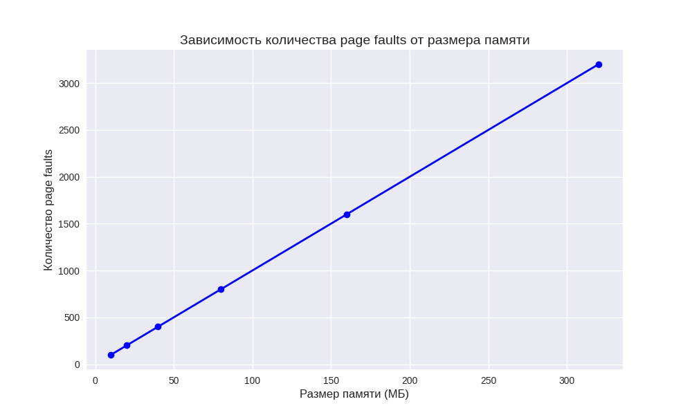

### Задание А

Программа `task_A.c` показывает, как работает память в Linux: выделяет память на стеке, в куче через `malloc`, через анонимный mmap и через mmap с файлом. Вывод программы (из файла `A_output.txt`) и проверки в консоли (`ps`, `/proc/17771/status`, `/proc/17771/smaps_rollup`) дают данные о памяти процесса с PID 17771. Ниже отвечаем на вопросы и сравниваем результаты программы с консольными утилитами, чтобы показать, как разные типы памяти влияют на метрики.

## Ответы на вопросы

### 1. Почему виртуальная память (VSZ) больше физической (RSS)?
Виртуальная память (VSZ) — это всё адресное пространство процесса, включая код программы, данные, стек, кучу и отображения памяти (mmap). В выводе программы VSZ = 64128 KB (~62.6 MB). Физическая память (RSS) — это только та часть, которая реально загружена в оперативку, здесь RSS = 62748 KB (~61.3 MB). Разница небольшая (~1.3 MB), потому что программа активно "трогает" память (записывает данные каждые 4096 байт), заставляя страницы загружаться в RAM. Без этого Linux выделяет память лениво: виртуально резервирует, но физически не загружает, пока не обратишься. Поэтому обычно VSZ больше RSS, но тут разница мала из-за активного использования памяти.

### 2. Где находятся разные типы памяти в адресном пространстве?
Карта памяти (`/proc/17771/maps`) показывает, где лежат разные типы памяти процесса. Адреса случайные из-за защиты (ASLR), но структура понятна:

- **Код программы**: Это исполняемый код, находится в регионах с правами `r-xp` (чтение, выполнение). Пример: `557ed31d5000-557ed31d6000` (4 KB, путь к файлу `/home/en1xer/.../A`).
- **Данные программы**: Постоянные данные, права `r--p` (только чтение) или `rw-p` (чтение/запись). Пример: `557ed31d6000-557ed31d9000` (4 KB).
- **Стек**: Место для локальных переменных, регион `[stack]`, права `rw-p`. В коде выделено 1 KB (массив `stack_var`), адрес ~`0x7ffe1a443730`. Пример: `7ffe1a424000-7ffe1a446000` (136 KB).
- **Куча**: 
  - Маленькие выделения в `[heap]`, права `rw-p`. Пример: `557eebaed000-557eebb0e000` (132 KB).
  - Крупное выделение (10 MB через `malloc`) — отдельный регион, так как `malloc` для больших кусков использует mmap. Пример: `71064abff000-71064b600000` (10244 KB, адрес ~`0x71064abff010`).
- **Анонимный mmap**: Память без привязки к файлу, права `rw-p`. В коде 50 MB, адрес ~`0x710647800000`. Пример: `710647800000-71064aa00000` (51200 KB).
- **Файловый mmap**: Память, привязанная к файлу (в коде `mmap_test.txt`, 4 KB). Не видна в карте, так как освобождена (`munmap`) до вывода.
- **Библиотеки**: Например, `libc.so.6` (регионы `71064b600000-71064b7ff000`).

### 3. Как изменилась физическая память (RSS) при выделении 1 MB через malloc и mmap?
В коде выделяется не 1 MB, а 10 MB через `malloc` и 50 MB через `mmap`, но память "трогается" (запись каждые 4096 байт), поэтому страницы загружаются в RAM. Для 1 MB эффект был бы таким:
- **Malloc**: Если маленький (до ~128 KB), расширяет `[heap]` через `brk`. Если большой (как 1 MB), использует mmap, создавая регион вроде `71064abff000-71064b600000`. При "трогании" RSS растет на ~1 MB.
- **Mmap**: Создает отдельный регион (как `710647800000-71064aa00000` для 50 MB). Для 1 MB RSS тоже растет на ~1 MB при "трогании".
Без "трогания" RSS не растет, только VSZ. В выводе RSS ~61.3 MB включает все выделения (10 MB + 50 MB + стек и прочее).

## Итоги
Программа показывает, как разные типы памяти (стек, куча, mmap) занимают адресное пространство и влияют на метрики. VSZ больше RSS из-за виртуального резервирования, но разница мала из-за активного использования памяти. Консольные проверки (`ps`, `/proc/status`) подтверждают данные программы. Malloc и mmap для крупных выделений работают похоже, увеличивая RSS при доступе.

## Сравнение метрик памяти

| Тип памяти        | Программа (KB) | Консоль (`/proc/status`, KB) | Примечание                              |
|-------------------|----------------|------------------------------|----------------------------------------|
| Виртуальная (VSZ) | 64128          | 64128                        | Полное адресное пространство            |
| Физическая (RSS)  | 62748          | 62912                        | Незначительная разница (~1 MB)          |
| Куча/Данные       | 61668          | 61668                        | Включает малый heap и крупный malloc    |
| Стек              | 136            | 136                          | Локальная переменная (1 KB) + резерв    |

### Задание B

Программа `task_B.c` сравнивает три метода чтения файла (100 MB): через системный вызов `read()`, через `mmap()` и через `mmap()` с `madvise(POSIX_MADV_SEQUENTIAL)`. Вывод программы (`output.txt`) содержит результаты 15 запусков, включая время выполнения, количество page faults и контрольные суммы. Ниже даны ответы на вопросы, анализ производительности и рекомендации по использованию методов. Результаты сравниваются в таблице.

## Ответы на вопросы

### Объяснение, почему один метод быстрее другого
Методы `mmap()` и `mmap() + madvise` в среднем быстрее (`0.632 с` и `0.633 с`) по сравнению с `read()` (`0.708 с`). Причины:
- **mmap()**: Файл отображается в память, и ядро само управляет загрузкой страниц при доступе. Нет копирования данных между ядром и пользовательским буфером, как в `read()`.
- **madvise(SEQUENTIAL)**: Подсказывает ядру, что доступ последовательный, что оптимизирует предварительную загрузку страниц (prefetching), снижая задержки.
- **read()**: Требует многократных системных вызовов и копирования данных в пользовательский буфер (4 KB за раз), что добавляет накладные расходы.

### Анализ

#### Какой метод быстрее? Почему?
- **Быстрее**: `mmap()` (0.632 с) и `mmap() + madvise` (0.633 с) против `read()` (0.708 с).
- **Причина**: `mmap()` минимизирует системные вызовы, работая через прямой доступ к памяти. `madvise` улучшает это за счет оптимизации чтения страниц. `read()` медленнее из-за копирования данных и множества вызовов.

#### Сколько page faults у каждого метода?
- **read()**: 2 minor page faults (буфер 4 KB требует минимум страниц).
- **mmap()**: 1600 minor page faults (каждая страница 4 KB для 100 MB файла загружается при первом доступе).
- **mmap() + madvise**: 1600 minor page faults (аналогично `mmap()`).
- **Примечание**: Major faults отсутствуют, так как файл, вероятно, в page cache после первого чтения или из-за быстрого SSD.

#### Как влияет размер файла на разницу?
- При увеличении размера файла разница между `mmap()` и `read()` растет: больше данных — больше системных вызовов и копирований для `read()`. Для `mmap()` накладные расходы на page faults фиксированы (по числу страниц), но prefetching с `madvise` помогает для больших файлов.

#### Что происходит при повторном запуске (когда файл в page cache)?
- Если файл в page cache, все методы работают быстрее, так как данные уже в RAM. `read()` меньше выигрывает, так как копирование все равно происходит. `mmap()` и `mmap() + madvise` выигрывают больше, так как page faults минимальны (данные уже отображены). В выводах время варьируется (например, `mmap()`: 0.598–0.686 с), что может указывать на частичное кэширование.

#### Что такое page cache и как он влияет на результаты?
- **Page cache**: Буфер в RAM, где Linux кэширует недавно прочитанные файлы. Если файл в кэше, чтение не требует обращения к диску, снижая время и major faults.
- **Влияние**: В тестах major faults = 0, значит, файл, вероятно, в page cache (особенно после первого запуска). Это ускоряет все методы, но `mmap()` выигрывает больше, так как избегает копирования.

#### Почему mmap может быть быстрее/медленнее read()?
- **Быстрее**: Нет копирования данных, меньше системных вызовов, прямой доступ к памяти. `madvise` усиливает эффект для последовательного чтения.
- **Медленнее**: При случайном доступе или малых файлах page faults могут добавить накладные расходы. Для больших файлов `mmap()` обычно выигрывает.

#### Когда стоит использовать каждый метод?
- **read()**: Для малых файлов, потокового чтения или когда не нужен многократный доступ. Прост в использовании.
- **mmap()**: Для больших файлов, многократного или случайного доступа. Эффективно при достаточной памяти.
- **mmap() + madvise**: Для больших файлов с последовательным чтением, где важна максимальная скорость.

## Итоги
`mmap()` и `mmap() + madvise` быстрее `read()` (~0.632 с против 0.708 с) за счет меньших накладных расходов на копирование и системные вызовы. `mmap()` вызывает больше page faults (1600 против 2), но это не замедляет его благодаря page cache. Размер файла усиливает преимущество `mmap()`. Page cache ускоряет все методы, особенно `mmap()`. Выбор метода зависит от размера файла и характера доступа.

## Сравнение производительности

| Метод                  | Время (с, среднее) | Minor Page Faults | Major Page Faults | Контрольная сумма |
|------------------------|--------------------|-------------------|-------------------|-------------------|
| read()                | 0.708              | 2                 | 0                 | 13369344000       |
| mmap()                | 0.632              | 1600              | 0                 | 13369344000       |
| mmap() + madvise      | 0.633              | 1600              | 0                 | 13369344000       |

Подробный вывод программ можно посмотреть в `output.txt`.

### Задание С

Программа `task_C.c` демонстрирует влияние различных сценариев использования памяти на page faults в Linux. Она включает шесть демо: выделение памяти без доступа, последовательный доступ, полное заполнение, случайный доступ, повторное чтение и сравнение `malloc` с `calloc`. Вывод программы (`output.txt`) показывает количество minor и major page faults. Ниже даны ответы на вопросы и анализ.

## Ответы на вопросы

### Почему при последовательном доступе больше page faults?
В демо 2 (последовательный доступ) возникает 25599 minor page faults при записи в каждую страницу (4 KB) 100 MB памяти. Это больше, чем в других сценариях, так как затрагивается каждая страница (100 MB / 4 KB = 25600). Linux использует ленивое выделение: физические страницы выделяются только при первом доступе, вызывая minor fault для каждой страницы.

### Почему major faults появляются (или нет)?
Major page faults отсутствуют (0 во всех демо), так как данные не подгружаются с диска (swap или файлы). Все операции происходят в RAM, а память новая (`malloc`/`calloc`). Major faults возникают при чтении с диска, но в тестах RAM достаточно, и swap не используется.

### Как изменится поведение при повторном запуске?
При повторном запуске число page faults может уменьшиться, если память (например, библиотеки) остается в page cache. Однако новые выделения (`malloc`/`calloc`) вызывают minor faults, так как требуют новых физических страниц. В выводе faults стабильны, так как демо каждый раз выделяют новую память.

### Почему malloc без записи не вызывает page faults?
В демо 1 (`malloc` 100 MB без доступа) — только 3 minor page faults. `malloc` резервирует виртуальную память, но физические страницы не выделяются без доступа (lazy allocation). Faults возникают только для метаданных кучи.

### Сколько page faults происходит при заполнении 100 MB памяти?
В демо 2 (последовательный доступ, 100 MB) — 25599 minor faults, почти 25600 (100 MB / 4 KB). В демо 3 (полное заполнение 50 MB через `memset`) — 12800 faults (50 MB / 4 KB). Faults пропорциональны числу страниц.

### Почему повторное чтение не вызывает новых faults?
В демо 5 (повторное чтение 50 MB) после записи (`memset`) новых faults нет (0). Первая запись загрузила все страницы (12800 faults). Повторное чтение использует уже загруженные страницы в RAM, поэтому faults не возникают.

### В чем разница между calloc и malloc с точки зрения page faults?
В демо 6:
- **malloc + memset** (50 MB): 12801 minor faults. `memset` записывает в каждую страницу, вызывая fault (50 MB / 4 KB = 12800) плюс метаданные.
- **calloc + read** (50 MB): 12800 minor faults. `calloc` обнуляет память, но при чтении вызывает faults из-за доступа к страницам.
- **calloc + write**: 12799 minor faults. После чтения страницы уже в памяти, запись почти не добавляет faults.
Разница мала: `calloc` оптимизирован (zero page, см. ниже), но при доступе faults схожи.

### Объясните zero page optimization для calloc
Zero page optimization: `calloc` отображает память на общую "нулевую" страницу (Copy-on-Write). При чтении возвращаются нули без faults, при записи выделяются физические страницы, вызывая minor faults. В демо 6 чтение вызывает faults, так как проверяется каждая страница.

### Как ОС управляет page faults?
ОС обрабатывает page faults:
1. **Minor fault**: При первом доступе к зарезервированной странице ОС выделяет физическую страницу в RAM и обновляет таблицы страниц.
2. **Major fault**: Если страница на диске (swap или файл), ОС загружает её в RAM. В тестах major faults нет, так как всё в RAM.
3. Процесс: ОС ловит исключение page fault, определяет причину, выделяет/загружает страницу и продолжает выполнение. Повторный доступ к странице faults не вызывает.

## Итоги
Программа показывает, как доступ к памяти влияет на page faults. Последовательный доступ (25599 faults для 100 MB) затрагивает каждую страницу. Major faults отсутствуют из-за работы в RAM. Повторное чтение не добавляет faults, так как страницы уже загружены. `calloc` и `malloc + memset` дают схожие faults, но `calloc` использует zero page optimization. Повторные запуски могут уменьшить faults за счет кэширования.

## Сравнение page faults

| Сценарий                  | Размер (MB) | Minor Faults (программа) | Major Faults (программа) | Примечание                              |
|---------------------------|-------------|--------------------------|--------------------------|----------------------------------------|
| Выделение без доступа     | 100         | 3                        | 0                        | Ленивое выделение, только метаданные   |
| Последовательный доступ   | 100         | 25599                    | 0                        | Fault на каждую страницу (25600)       |
| Полное заполнение         | 50          | 12800                    | 0                        | 50 MB / 4 KB = 12800 страниц           |
| Случайный доступ          | 100         | 8249                     | 0                        | Не все страницы затронуты (10000 доступов) |
| Повторное чтение (write)  | 50          | 12800                    | 0                        | Первая запись загружает страницы        |
| Повторное чтение (read)   | 50          | 0                        | 0                        | Страницы уже в памяти                  |
| malloc + memset           | 50          | 12801                    | 0                        | Полное заполнение страниц              |
| calloc + read             | 50          | 12800                    | 0                        | Faults при чтении (zero page)          |
| calloc + write            | 50          | 12799                    | 0                        | Faults уже вызваны при чтении          |

## График: размер памяти vs количество page faults
Ниже график зависимости количества minor page faults от размера памяти(линейно):

Подробный вывод программ можно посмотреть в `output.txt`.ё