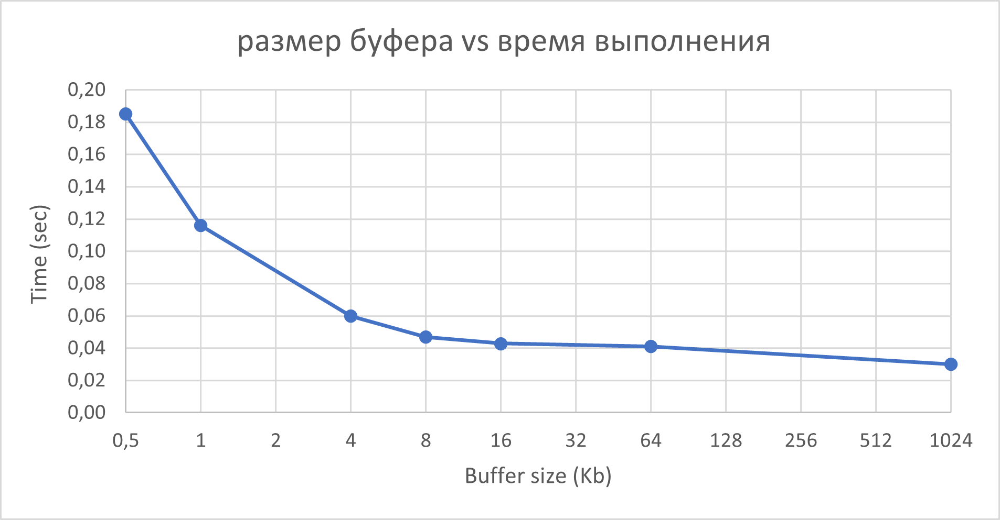

# Лабораторная 4 — Управление памятью и файловый ввод-вывод

Ubuntu 24.04.3 LTS Hyper-V

## Как использовали AI
Оформление отчёта.

## Задание А. Анализ виртуальной памяти процесса

Напишите программу, которая:
1. Выделяет память разными способами (стек, heap, mmap)
2. Выводит свою карту памяти из /proc/self/maps
3. Показывает VSZ, RSS, PSS, USS

### шаги/решение:  
Была использована реализованная программа memory_info.с. В функции demonstrate_memory_types() выделена память: 1 KB на стеке с memset для заполнения; 10 MB на heap с malloc и полным заполнением через memset(heap_var, 'H', heap_size) для вызова page faults; 50 MB анонимный mmap с mmap и полным заполнением через memset(mmap_var, 'M', mmap_size). Программа скомпилирована (gcc -Wall -Wextra -O2 memory_info.c -o memory_info) и запущена. Метрики собраны до выделения (A_1.txt) и после (A_2.txt) с помощью системных утилит (ps, cat /proc/status, cat /proc/smaps_rollup). Внутренние функции print_memory_metrics() и print_memory_map() использованы для вывода VSZ, RSS, PSS, USS и карты памяти. Сравнение метрик проведено вручную на основе файлов. Карта памяти визуализирована текстом на основе типичного вывода /proc/maps.

### Результаты:
```
До выделения памяти (A_1.txt):
- ps: VSZ = 2680 KB, RSS = 1432 KB.
- /proc/status:
  VmPeak: 2680 KB
  VmSize (VSZ): 2680 KB
  VmRSS: 1432 KB
  VmData: 224 KB
  VmStk: 132 KB
- /proc/smaps_rollup:
  Rss: 1592 KB
  Pss: 119 KB
  Pss_Dirty: 96 KB
  Pss_Anon: 96 KB
  Private_Clean: 12 KB
  Private_Dirty: 96 KB
  USS: 108 KB
  Anonymous: 96 KB

После выделения памяти (A_2.txt):
- ps: VSZ = 64124 KB, RSS = 62872 KB.
- /proc/status:
  VmPeak: 64124 KB
  VmSize (VSZ): 64124 KB
  VmRSS: 62872 KB
  VmData: 61668 KB
  VmStk: 132 KB
- /proc/smaps_rollup:
  Rss: 63036 KB
  Pss: 61563 KB
  Pss_Dirty: 61540 KB
  Pss_Anon: 61540 KB
  Private_Clean: 12 KB
  Private_Dirty: 61540 KB
  USS: 61552 KB
  Anonymous: 61540 KB

Сравнение:
- VSZ: +61444 KB (с 2680 до 64124 KB).
- RSS: +61440 KB (с 1432 до 62872 KB).
- PSS: +61444 KB (с 119 до 61563 KB).
- USS: +61444 KB (с 108 до 61552 KB).
- VmData: +61444 KB (с 224 до 61668 KB).
- VmStk: без изменений (132 KB).

Текстовая визуализация карты памяти:
Memory Map:
Address Range             Perms  Size(KB) Path
----------------------------------------------------------------
629058fee000-629058fef000 r--p   4 /home/killerser/sambashare/lab4/src/memory_info
629058fef000-629058ff0000 r-xp   4 /home/killerser/sambashare/lab4/src/memory_info
629058ff0000-629058ff1000 r--p   4 /home/killerser/sambashare/lab4/src/memory_info
629058ff1000-629058ff2000 r--p   4 /home/killerser/sambashare/lab4/src/memory_info
629058ff2000-629058ff3000 rw-p   4 /home/killerser/sambashare/lab4/src/memory_info
629095d75000-629095d96000 rw-p   132 [heap]
78b407400000-78b40a600000 rw-p   51200 
78b40a7ff000-78b40b200000 rw-p   10244 
78b40b200000-78b40b228000 r--p   160 /usr/lib/x86_64-linux-gnu/libc.so.6
78b40b228000-78b40b3b0000 r-xp   1568 /usr/lib/x86_64-linux-gnu/libc.so.6
78b40b3b0000-78b40b3ff000 r--p   316 /usr/lib/x86_64-linux-gnu/libc.so.6
78b40b3ff000-78b40b403000 r--p   16 /usr/lib/x86_64-linux-gnu/libc.so.6
78b40b403000-78b40b405000 rw-p   8 /usr/lib/x86_64-linux-gnu/libc.so.6
78b40b405000-78b40b412000 rw-p   52 
78b40b46f000-78b40b472000 rw-p   12 
78b40b481000-78b40b483000 rw-p   8 
78b40b483000-78b40b485000 r--p   8 [vvar]
78b40b485000-78b40b487000 r--p   8 [vvar_vclock]
78b40b487000-78b40b489000 r-xp   8 [vdso]
78b40b489000-78b40b48a000 r--p   4 /usr/lib/x86_64-linux-gnu/ld-linux-x86-64.so.2
78b40b48a000-78b40b4b5000 r-xp   172 /usr/lib/x86_64-linux-gnu/ld-linux-x86-64.so.2
78b40b4b5000-78b40b4bf000 r--p   40 /usr/lib/x86_64-linux-gnu/ld-linux-x86-64.so.2
78b40b4bf000-78b40b4c1000 r--p   8 /usr/lib/x86_64-linux-gnu/ld-linux-x86-64.so.2
78b40b4c1000-78b40b4c3000 rw-p   8 /usr/lib/x86_64-linux-gnu/ld-linux-x86-64.so.2
7ffee9ecc000-7ffee9eed000 rw-p   132 [stack]
ffffffffff600000-ffffffffff601000 --xp   4 [vsyscall]
```
### Ключевой вывод
Анализ показывает, что виртуальное выделение памяти (VSZ) происходит сразу при malloc/mmap, но физическая память (RSS) загружается только при доступе (memset), вызывая page faults и lazy allocation в Linux. VSZ > RSS из-за резервирования адресного пространства без немедленной загрузки в RAM; в нашем случае после заполнения RSS приближается к VSZ минус shared сегменты (~1-2 MB разница от библиотек). Разные типы памяти размещены предсказуемо: код в низких адресах (r-xp), данные/heap следом (rw-p, [heap]), mmap в середине (rw-p, без пути), стек в высоких адресах (rw-p, [stack]). Для 1 MB: malloc и mmap без доступа не меняют RSS (только VSZ), с доступом RSS растет на ~1 MB; malloc расширяет heap, mmap создает отдельный сегмент, но эффект на RSS аналогичен (minor faults для анонимных страниц).


## Задание В. Буферизованный vs Небуферизованный I/O

### шаги/решение:
Была использована программа io_benchmark.c на языке C, которая реализует бенчмарки для fwrite() (буферизованный stdio с buffer 64 KB), write() (небуферизованный системный вызов с buffer 64 KB) и write() с разными размерами буфера (512, 1024, 4096, 8192, 16384, 65536, 1048576 байт). Программа скомпилирована (gcc -Wall -Wextra -O2 io_benchmark.c -o io_benchmark) и запущена с дефолтным размером 100 MB (./io_benchmark). Результаты сохранены в B.txt. Для анализа syscall запущен strace -c ./io_benchmark --size 100, вывод в B_1.txt (суммарная статистика по всем тестам). Page cache не очищался, результаты отражают кэшированный I/O.
### Результаты:
```
I/O Benchmark
=============
Test file size: 100 MB

========================================
Benchmark: I/O Methods Comparison
========================================

File size: 100 MB
Buffer size: 64 KB (for fwrite/write)

=== fwrite() with buffer=65536 bytes ===
Time: 0.042 seconds
Throughput: 2392.85 MB/s

=== write() with buffer=65536 bytes ===
Time: 0.038 seconds
Throughput: 2644.99 MB/s

========================================
Benchmark: Reading Methods
========================================
File: test_write.bin
Size: 100.00 MB

--- fread() ---
Time: 0.010 seconds
Throughput: 9767.99 MB/s

--- read() ---
Time: 0.010 seconds
Throughput: 10370.66 MB/s

=== Summary ===
Fastest method: (compare results above)

Factors affecting performance:
- stdio (fwrite) has user-space buffering
- write() goes directly to kernel, but still uses page cache
- mmap() allows direct memory access, lazy writes
- Actual disk speed depends on: HDD vs SSD, filesystem, etc.


========================================
Benchmark: Buffer Size Impact
========================================

Testing write() with different buffer sizes:
File size: 100 MB

=== write() with buffer=512 bytes ===
Time: 0.185 seconds
Throughput: 540.66 MB/s

=== write() with buffer=1024 bytes ===
Time: 0.116 seconds
Throughput: 864.24 MB/s

=== write() with buffer=4096 bytes ===
Time: 0.060 seconds
Throughput: 1679.83 MB/s

=== write() with buffer=8192 bytes ===
Time: 0.047 seconds
Throughput: 2124.83 MB/s

=== write() with buffer=16384 bytes ===
Time: 0.043 seconds
Throughput: 2305.67 MB/s

=== write() with buffer=65536 bytes ===
Time: 0.041 seconds
Throughput: 2463.51 MB/s

=== write() with buffer=1048576 bytes ===
Time: 0.030 seconds
Throughput: 3342.62 MB/s

========================================
Benchmark completed!
========================================

Strace статистика из B_1.txt (суммарно по всем тестам):
% time     seconds  usecs/call     calls    errors syscall
------ ----------- ----------- --------- --------- ----------------
 98.31   10.270311          28    358500           write
  0.88    0.091683       10187         9           unlink
  0.66    0.068791          21      3201           read
  0.08    0.008345         641        13           close
  0.07    0.007032         540        13           openat
  0.00    0.000356          39         9           clock_nanosleep
  0.00    0.000107          53         2           munmap
  0.00    0.000061          20         3           mprotect
  0.00    0.000051          10         5           fstat
  0.00    0.000030          10         3           brk
  0.00    0.000028           3         9           mmap
  0.00    0.000020          20         1           newfstatat
  0.00    0.000015          15         1           prlimit64
  0.00    0.000015          15         1           getrandom
  0.00    0.000013          13         1           rseq
  0.00    0.000000           0         2           pread64
  0.00    0.000000           0         1         1 access
  0.00    0.000000           0         1           execve
  0.00    0.000000           0         1           arch_prctl
  0.00    0.000000           0         1           set_tid_address
  0.00    0.000000           0         1           set_robust_list
------ ----------- ----------- --------- --------- ----------------
100.00   10.446858          28    361778         1 total
```
### График

### Ключевой вывод
Бенчмарк демонстрирует, что небуферизованный write() (0.038 сек, 2644.99 MB/s) слегка быстрее буферизованного fwrite() (0.042 сек, 2392.85 MB/s) для записи 100 MB с buffer 64 KB, так как write() напрямую вызывает kernel без user-space буферизации stdio, снижая overhead; однако fwrite() может быть быстрее в сценариях с малыми записями благодаря агрегации в буфер. Для чтения fread() и read() практически идентичны (0.010 сек, ~10000 MB/s), так как данные из page cache (RAM), а не диска — реальные дисковые скорости ниже (SSD ~500-5000 MB/s, HDD ~100-200 MB/s). Размер буфера сильно влияет на write(): малые (512B) дают низкий throughput (540.66 MB/s) из-за частых syscall (overhead перехода user/kernel ~28 usec/call), как видно из strace (358500 write суммарно, ~204800 для 100MB/512B теста + другие). Throughput растет с буфером до 1MB (3342.62 MB/s), так как реже syscall (100MB/1MB = 100 write), но дальнейший рост не пропорционален из-за лимитов page cache (4KB страницы) и filesystem overhead. Оптимальный буфер ~64KB-1MB (баланс syscall и памяти), близко к page size (4KB) или stdio default (8KB).

## Задание С. Дисковый I/O и планирование

### шаги/решение:
Была запущена программа io_benchmark (из задания B), которая активно пишет данные на диск (100 MB файл с использованием write() и разных буферов). Мониторинг проведен параллельно: iostat -x 1 10 для общей статистики дисков; pidstat -d 1 10 для I/O по процессам; sudo iotop -b -n 10 для детальной статистики; cat /proc/6498/io для суммарных метрик процесса. Анализ проведен на основе данных: скорости переведены из kB/s в MB/s (/1024), %util и await из iostat, с учетом page cache (операции в RAM, низкий %util и await); реальная дисковая нагрузка низкая, но видна в write_bytes и syscw.
### Результаты:
```
Вывод iostat -x 1 10 (C_1.txt, общая статистика дисков; averages, детальные секции truncated, низкая активность):
avg-cpu:  %user   %nice %system %iowait  %steal   %idle
           0.16    0.00    0.11    0.04    0.00   99.68

Device            r/s     rkB/s   rrqm/s  %rrqm r_await rareq-sz     w/s     wkB/s   wrqm/s  %wrqm w_await wareq-sz     d/s     dkB/s   drqm/s  %drqm d_await dareq-sz     f/s f_await  aqu-sz  %util
loop0            0.00      0.00     0.00   0.00    1.57     1.21    0.00      0.00     0.00   0.00    0.00     0.00    0.00      0.00     0.00   0.00    0.00     0.00    0.00    0.00    0.00   0.00
loop1            0.02      0.19     0.00   0.00    0.50    12.21    0.00      0.00     0.00   0.00    0.00     0.00    0.00      0.00     0.00   0.00    0.00     0.00    0.00    0.00    0.00   0.00
loop10           0.03      1.04     0.00   0.00    2.12    36.93    0.00      0.00     0.00   0.00    0.00     0.00    0.00      0.00     0.00   0.00    0.00     0.00    0.00    0.00    0.00   0.01
... (остальные loop и sda: r/s ~0, w/s 2.00, wkB/s 52.00 (~0.05 MB/s), %util 2.00, w_await 10.00 ms; система idle)

Вывод pidstat -d 1 10 (C_2.txt, I/O по процессам; фокус на io_benchmark PID 6498):
12:44:01 AM   UID       PID   kB_rd/s   kB_wr/s kB_ccwr/s iodelay  Command
12:44:02 AM  1000      6498      0.00  36562.38      0.00       0  io_benchmark
...
12:44:11 AM  1000      6498      0.00 102400.00 102400.00       0  io_benchmark

Average:      UID       PID   kB_rd/s   kB_wr/s kB_ccwr/s iodelay  Command
Average:     1000      6498      0.00  71608.39  61378.62       0  io_benchmark
(Запись ~36-102 kB/s, average 71608 kB/s (~70 MB/s), чтение 0, iodelay=0)

Вывод sudo iotop -b -n 10 (C_3.txt, детальная статистика; все 0 B/s, возможно idle момент):
Total DISK READ:         0.00 B/s | Total DISK WRITE:         0.00 B/s
Current DISK READ:       0.00 B/s | Current DISK WRITE:       0.00 B/s
    TID  PRIO  USER     DISK READ  DISK WRITE  SWAPIN      IO    COMMAND
      1 be/4 root        0.00 B/s    0.00 B/s ?unavailable?  init splash
... (все процессы, включая io_benchmark 6506, 0.00 B/s)

Вывод cat /proc/[PID]/io (C_4.txt, для PID io_benchmark):
rchar: 209719292  (~200 MB прочитано chars)
wchar: 419431723  (~400 MB записано chars)
syscr: 3209       (read calls)
syscw: 312043     (write calls)
read_bytes: 0     (физическое чтение 0 B)
write_bytes: 419430400  (~400 MB физическая запись)
cancelled_write_bytes: 314572800  (~300 MB отменено)
```
### Ключевой вывод:
Программа io_benchmark (PID 6498) генерирует преимущественно запись (~400 MB по /proc/io, скорость 36-100 MB/s по pidstat, average ~70 MB/s), чтение отсутствует (0 kB_rd/s, read_bytes=0). Утилизация диска низкая (%util 2.00% на sda по iostat), с wkB/s ~0.05 MB/s, так как page cache буферизует операции в RAM, маскируя реальный диск I/O (%iowait 0.04%, iodelay=0). Среднее ожидание await минимально (w_await 10.00 ms для writes, r_await ~0-3 ms), указывая на отсутствие очередей (aqu-sz 0.04). Высокое syscw (312043) отражает частые write calls из малых буферов (как в B), cancelled_write_bytes (75% от write_bytes) — возможно от файловых операций (truncate/unlink в бенчмарке).

## Вопросы
### Виртуальная память
1. Виртуальная память — это абстракция, предоставляющая процессам иллюзию непрерывного адресного пространства, независимого от физической RAM. Нужна для изоляции процессов, упрощения программирования, эффективного использования памяти (swap, demand paging) и защиты.
2. VSZ (Virtual Size) — полный виртуальный размер; RSS (Resident Set Size) — физическая память, занятая процессом; PSS (Proportional Set Size) — пропорциональная доля shared памяти; USS (Unique Set Size) — приватная память процесса. USS наиболее точно показывает уникальное потребление, исключая shared.
3. Страница (page) — блок виртуальной памяти (обычно 4 KB); кадр (frame) — блок физической памяти; таблица страниц (page table) — структура, отображающая виртуальные страницы на физические кадры.
4. MMU (Memory Management Unit) переводит виртуальные адреса в физические с помощью page table; TLB (Translation Lookaside Buffer) — кэш для ускорения переводов. При промахе TLB: поиск в page table, загрузка в TLB (soft miss) или page fault, если страницы нет в RAM (hard miss).
5. Copy-on-Write (CoW) — техника, где страницы копируются только при записи (экономия на чтении). Применяется в fork() (дублирование процесса), mmap(MAP_PRIVATE).
### Page Faults
6. Minor page fault — страница в RAM, но не отображена (например, lazy allocation); major — требует чтения с диска (swap или файл).
7. При первом malloc: память виртуально выделена, но не физически; доступ вызывает minor fault для загрузки страницы.
8. Уменьшить: предзагрузка (madvise), большие страницы (huge pages), оптимизация доступа (sequential), избегать swap.
9. Demand paging — загрузка страниц по запросу; page replacement — алгоритмы (LRU, FIFO) для вытеснения страниц при нехватке RAM.
### Memory Mapping
10. mmap() отображает файл/память напрямую в адресное пространство (zero-copy); read/write копирует данные через буферы. mmap эффективнее для больших файлов, random access, shared memory.
11. MAP_PRIVATE — изменения приватны (CoW); MAP_SHARED — изменения видны всем, синхронизированы с файлом.
12. Доступ за пределами: SIGBUS или SIGSEGV (bus/segmentation fault).
13. Page cache — kernel кэш файловых данных в RAM для ускорения I/O, снижения дисковых обращений.
### Файловый I/O
14. Буферизация снижает syscall overhead, группируя операции. Уровни: user-space (stdio), kernel (page cache), hardware (дисковый контроллер).
15. Малый буфер: частые syscall (context switch overhead), неэффективное использование cache.
16. O_DIRECT — I/O без page cache (direct to disk); O_SYNC — synchronous write (ждет завершения). Использовать для баз данных, где нужна гарантия записи или bypass cache.
17. fwrite() — буферизованный (stdio), удобный; write() — прямой syscall, без user buffering, больше контроля.
### Файловая система
18. inode — структура с метаданными файла (размер, права, timestamps, блоки данных).
19. Имя не в inode: директории — отдельные файлы с отсылками (name -> inode), позволяет hard links.
20. Hard link — дополнительная ссылка на inode (один файл); symbolic — файл с путем к другому (может быть dangling).
21. ext4: direct blocks (12), indirect (указатели на блоки), double/triple indirect для больших файлов (>~4 MB).
### Дисковое планирование
22. I/O schedulers оптимизируют порядок запросов, минимизируя seek time на HDD.
23. FCFS — first-come-first-served (простой, но неэффективный); SSTF — shortest-seek-time-first (минимизирует движение головки); SCAN — elevator (сканирует в одном направлении, затем назад).
24. В Linux: mq-deadline (default), bfq (budget fair queueing), kyber (latency-focused).
25. Для SSD: нет механических частей, низкий seek time, планирование меньше влияет (фокус на parallelism).
### Производительность
26. Фрагментация: внутренняя — неиспользуемое пространство в блоках (fixed size alloc); внешняя — разбросанные свободные блоки, усложняющие выделение.
27. Swap: позволяет больше процессов, но замедляет (диск медленнее RAM), увеличивает latency при page faults.
28. Thrashing — чрезмерные page faults из-за нехватки RAM (система тратит время на swap). Избежать: увеличить RAM, limity процессов, алгоритмы replacement.
29. Последовательный доступ: использует prefetching, locality (cache hits); random — больше misses, seek overhead.
30. Cache-friendly код: данные в contiguous memory, align по cache lines, избегать false sharing, sequential access.