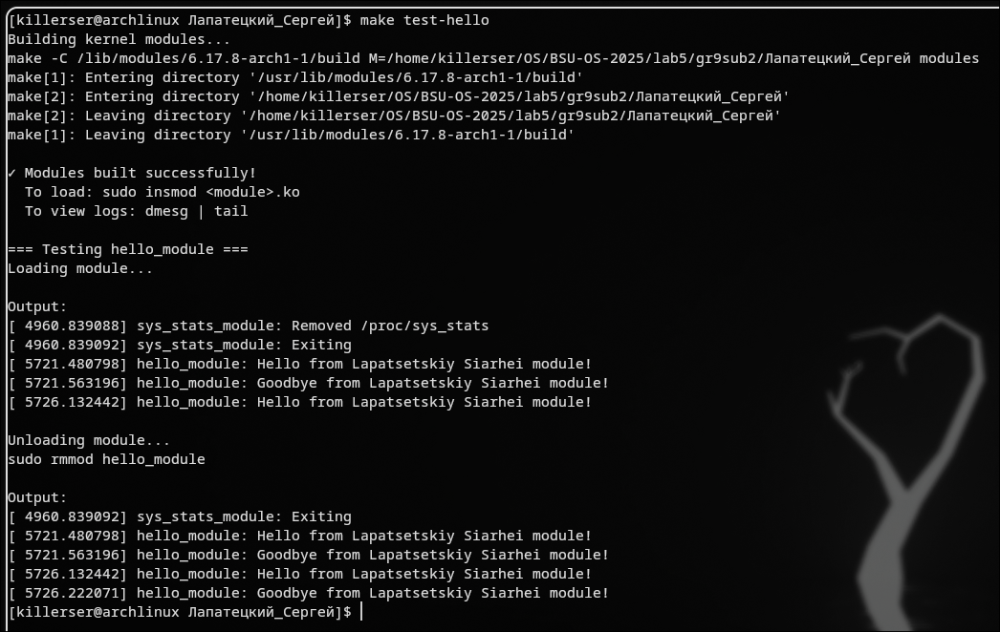
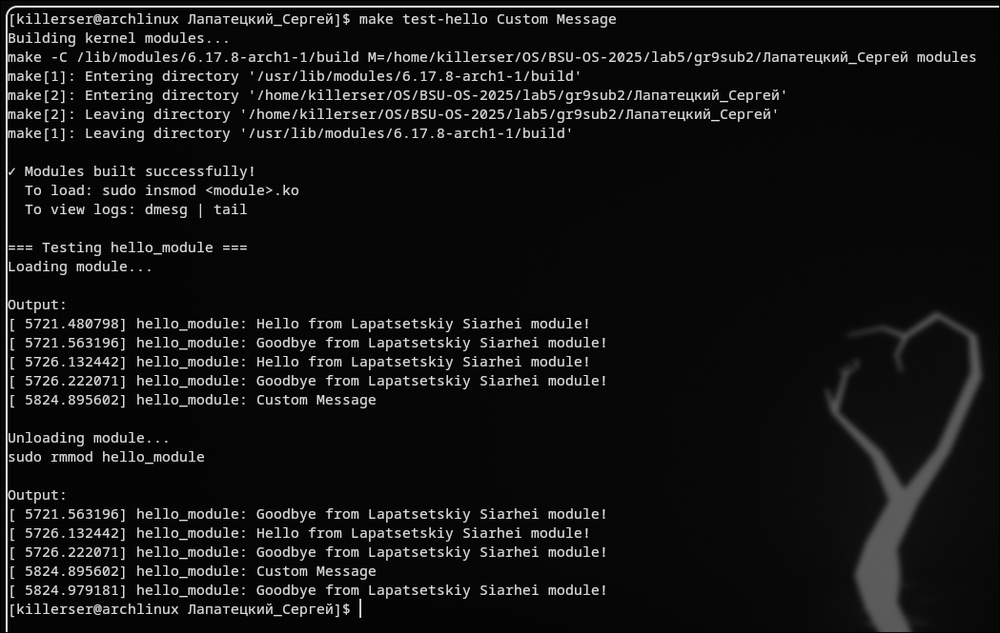
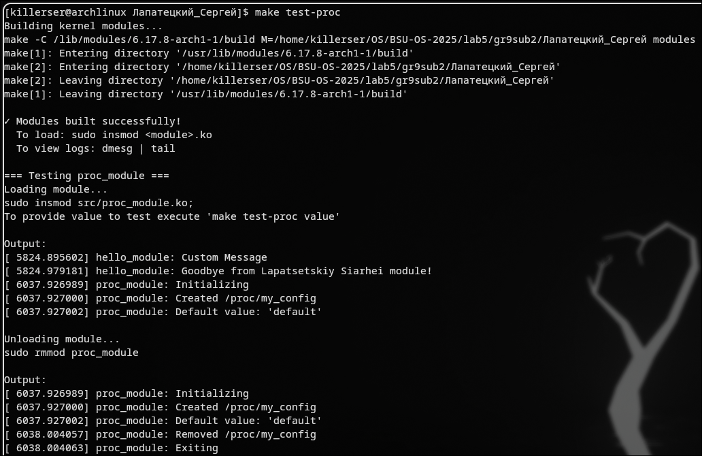
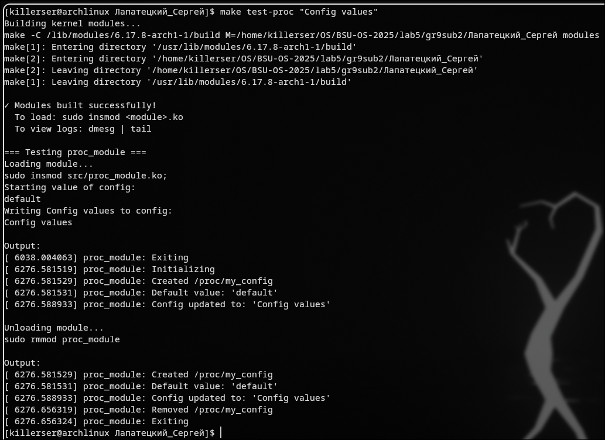
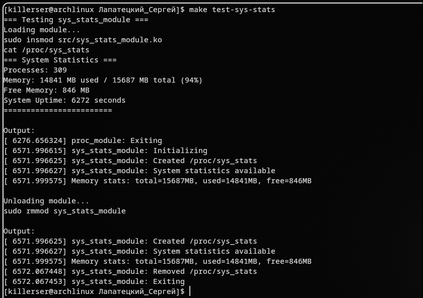

# Лабораторная 5 — Модули ядра Linux

OS: Arch Linux x86_64  
Kernel: Linux 6.17.8-arch1-1

## Как использовали AI
Оформление отчёта.

## Задание A: Hello World модуль

Создайте простой модуль, который:
- При загрузке (insmod) выводит "Hello from [ВАШ_ИМЯ] module!"
- При выгрузке (rmmod) выводит "Goodbye from [ВАШ_ИМЯ] module!"
- Принимает параметр message (строка)
- Если параметр задан, выводит его вместо дефолтного сообщения

Требования:
- Использовать printk с KERN_INFO
- Правильные метаданные (MODULE_LICENSE, MODULE_AUTHOR)
- module_param для параметра

### шаги/решение:
1. Был создан файл `hello_module.c` с реализацией модуля ядра
2. В функции `hello_init()` реализована логика вывода при загрузке модуля:
   - Проверка наличия параметра `message`
   - Вывод кастомного сообщения при наличии параметра
   - Вывод дефолтного сообщения "Hello from Lapatsetskiy Siarhei module!" если параметр не задан
3. В функции `hello_exit()` реализован вывод сообщения при выгрузке модуля
4. Настроен параметр модуля с помощью `module_param(message, charp, 0644)` с правами доступа 0644
5. Добавлены метаданные модуля: лицензия GPL, автор, описание и версия
6. Скомпилирован модуль с помощью Makefile
7. Проведено тестирование модуля:
- Загрузка без параметров: `make test-hello`
- Загрузка с параметром: `make test-hello "Custom greeting"`

### Результаты:





### Ключевой вывод
Модуль ядра успешно реализован и функционирует согласно требованиям. Параметр `message` корректно передается и обрабатывается - при его наличии выводится кастомное сообщение, при отсутствии используется сообщение по умолчанию. Механизм `module_param` обеспечивает удобную передачу строковых параметров в модуль с указанием прав доступа 0644. Метаданные модуля содержат всю необходимую информацию для идентификации. Сообщения выводятся в системный журнал через `printk(KERN_INFO)` и успешно отображаются с помощью `dmesg`.


## Задание B: /proc файл с записью

Создайте модуль, который создаёт файл /proc/my_config с возможностью записи:
- По умолчанию содержит строку "default"
- При записи (echo "text" > /proc/my_config) сохраняет новое значение
- При чтении (cat /proc/my_config) возвращает текущее значение
- Максимальная длина строки: 256 символов

Требования:
- Использовать proc_create() с правами 0666
- Реализовать и proc_read и proc_write
- Использовать copy_from_user() для записи

### шаги/решение:
1. Был создан файл `proc_module.c` с реализацией модуля ядра для работы с proc файловой системой
2. В функции `proc_module_init()` выполнена инициализация:
   - Выделена память под данные конфигурации по умолчанию "default"
   - Создан proc файл `/proc/my_config` с правами 0666 с помощью `proc_create()`
   - Настроены операции чтения/записи через структуру `proc_file_ops`
3. Реализована функция `proc_read()` для чтения данных:
   - Используется мьютекс `config_mutex` для защиты от гонок данных
   - Форматирование данных в буфер с помощью `snprintf()`
   - Копирование данных в пользовательское пространство через `copy_to_user()`
   - Поддержка правильной семантики позиционирования через `*ppos`
4. Реализована функция `proc_write()` для записи данных:
   - Проверка размера входных данных (максимум 256 символов)
   - Выделение временного буфера в пространстве ядра с `kmalloc()`
   - Копирование данных из пользовательского пространства через `copy_from_user()`
   - Обработка строки (удаление символа новой строки, добавление null-терминатора)
   - Освобождение старой и выделение новой памяти под данные конфигурации
   - Защита операций записи мьютексом
5. В функции `proc_module_exit()` выполнена корректная очистка:
   - Удаление proc файла через `proc_remove()`
   - Освобождение выделенной памяти через `kfree()`
6. Модуль скомпилирован с помощью Makefile и протестирован:
   - Загрузка без параметров: `make test-proc`
   - Загрузка с параметром: `make test-proc "Config values"`

### Результаты:




### Ключевой вывод
Модуль успешно реализовал функциональность read/write proc файла с корректной работой с памятью и синхронизацией. Использование мьютекса `config_mutex` обеспечивает защиту от состояний гонки при одновременном доступе к данным. Механизмы `copy_from_user()` и `copy_to_user()` правильно обеспечивают передачу данных между пространством пользователя и ядра. Proc файл создается с правами 0666, что позволяет чтение и запись любому пользователю. Обработка граничных случаев (длинные строки, пустой ввод) реализована корректно - данные обрезаются до максимального размера. Все ресурсы (память, proc entry) корректно освобождаются при выгрузке модуля.

## Задание C: /proc файл со статистикой системы

Создайте модуль, который создаёт файл /proc/sys_stats с информацией:
- Количество запущенных процессов (из /proc)
- Используемая память (можно приблизительно через si_meminfo)
- Uptime системы (через jiffies_to_msecs())

Требования:
- Реализовать функцию чтения
- Форматировать вывод в читаемом виде

### шаги/решение:
1. Был создан файл `sys_stats_module.c` с реализацией модуля ядра для отображения системной статистики
2. В функции `sys_stats_module_init()` создан proc файл `/proc/sys_stats` с правами 0444 (только для чтения)
3. Реализована функция `count_processes()` для подсчета количества процессов:
   - Использован макрос `for_each_process()` для итерации по всем задачам в системе
   - Применен `rcu_read_lock()`/`rcu_read_unlock()` для безопасного доступа к списку процессов
4. Реализована функция `get_memory_info()` для получения информации о памяти:
   - Использована функция `si_meminfo()` для получения сырых данных о памяти
   - Корректный расчет с учетом `PAGE_SIZE`: `(mem_info.totalram * PAGE_SIZE) / (1024 * 1024)` для перевода в мегабайты
   - Добавлена отладочная информация через `printk()` для верификации расчетов
5. В функции `proc_read()` собрана полная статистика:
   - Получено количество процессов через `count_processes()`
   - Получена информация о памяти через `get_memory_info()`
   - Рассчитано время работы системы через `jiffies_to_msecs(get_jiffies_64()) / 1000`
   - Вычислен процент использования памяти: `(used_mem * 100) / total_mem`
6. Реализовано форматирование вывода в читаемом виде с разделителями и четкой структурой
7. Модуль скомпилирован и протестирован:
   - Тестирование `make test-sys-stats`

### Результаты:



### Ключевой вывод
Модуль успешно реализован и предоставляет актуальную статистику системы в реальном времени. Количество процессов корректно подсчитывается путем итерации по всем задачам в системе. Важно отметить, что значение "used memory" включает в себя кэшированную память (cached memory), что является нормальным поведением в Linux - ядро использует свободную память для кэширования дисковых операций, чтобы повысить производительность системы. Это объясняет почему может показываться высокое использование памяти даже когда приложениям фактически требуется меньше. Процент использования рассчитывается корректно и дает понятное представление о загрузке системы. Время работы системы точно преобразуется из jiffies в секунды, предоставляя актуальный uptime.

## Вопросы
### Базовые понятия
1. Что такое модуль ядра и зачем он нужен?
Модуль ядра - это динамически загружаемый компонент ядра Linux, который расширяет его функциональность без необходимости перекомпиляции или перезагрузки всей системы. Модули используются для добавления драйверов устройств, файловых систем, сетевых протоколов и других низкоуровневых функций.

2. Чем отличается kernel-space от user-space?

    Kernel-space: Привилегированный режим работы с полным доступом к оборудованию и памяти, выполняется код ядра

    User-space: Непривилегированный режим с ограниченным доступом, выполняется пользовательские приложения

    Изоляция обеспечивает стабильность системы - ошибки в user-space не крашат всю систему

3. Что произойдёт, если в модуле обратиться к NULL указателю?
Произойдет kernel panic или oops (kernel fault). В отличие от user-space, где SIGSEGV обрабатывается, в ядре нет механизма восстановления после таких ошибок, что приводит к аварийному завершению системы.

4. Почему нельзя использовать printf() в модуле ядра?
printf() работает с stdout, который недоступен в kernel-space. Вместо этого используется printk(), который записывает сообщения в буфер ядра (kernel ring buffer) для последующего просмотра через dmesg.

5. Что такое kernel panic и как его избежать?
Kernel panic - это критическая ошибка ядра, приводящая к остановке системы. Для избежания:

    Проверять указатели перед использованием

    Проверять возвращаемые значения функций

    Использовать правильные флаги выделения памяти

    Избегать бесконечных циклов

### Жизненный цикл модуля

6. Какие функции вызываются при insmod и rmmod?

    При insmod: вызывается функция, указанная в module_init()

    При rmmod: вызывается функция, указанная в module_exit()

7. Что должна делать функция module_exit()?
Освобождать все ресурсы, выделенные модулем:

    Удалять созданные proc/sysfs файлы

    Освобождать выделенную память (kfree)

    Отменять регистрацию устройств

    Закрывать сетевые соединения

8. Что происходит, если module_init() возвращает ошибку?
Модуль не загружается, система возвращает код ошибки. Все ресурсы, выделенные до момента ошибки, должны быть освобождены.

9.  Можно ли выгрузить модуль, если он используется?
По умолчанию нельзя. Модуль можно выгрузить только когда счетчик использования (module_refcount) равен 0. Для принудительной выгрузки можно использовать rmmod -f, но это опасно.
### Логирование и отладка

10. Чем printk() отличается от printf()?

    printk() не буферизуется как printf()

    printk() имеет уровни логирования (KERN_INFO, KERN_ERR и т.д.)

    printk() записывает в ring buffer ядра, а не в stdout

11. Какие уровни логирования существуют в ядре?

    KERN_EMERG (0) - аварийные сообщения

    KERN_ALERT (1) - тревожные сообщения

    KERN_CRIT (2) - критические ошибки

    KERN_ERR (3) - ошибки

    KERN_WARNING (4) - предупреждения

    KERN_NOTICE (5) - важные уведомления

    KERN_INFO (6) - информационные сообщения

    KERN_DEBUG (7) - отладочная информация

12. Как посмотреть логи модуля?
```
dmesg | grep "имя_модуля"
journalctl -k | grep "имя_модуля"
```

13. Что означает "tainted kernel"?
"Tainted" (загрязненное) ядро - это ядро, в которое загружены проприетарные модули или модули без подписи. Это влияет на поддержку и отладку, так как разработчики ядра могут отказаться анализировать проблемы в таких системах.
### Память

14. Чем kmalloc() отличается от malloc()?

    kmalloc() выделяет память в kernel-space, malloc() - в user-space

    kmalloc() работает с физически смежной памятью

    kmalloc() требует указания флагов GFP (Get Free Pages)

    kmalloc() не инициализирует память нулями (кроме GFP_ZERO)

15. Что такое флаги GFP и зачем они нужны?
Флаги GFP определяют поведение аллокатора памяти:

    GFP_KERNEL - обычное выделение, может спать

    GFP_ATOMIC - атомарное выделение, не может спать

    GFP_DMA - для DMA-совместимой памяти

    GFP_ZERO - инициализировать память нулями

16. Что произойдёт, если не освободить память в module_exit()?
Произойдет утечка памяти ядра. После выгрузки модуля эта память останется неосвобожденной до перезагрузки системы.

17. Почему нельзя использовать user-space указатели напрямую в ядре?
User-space указатели недействительны в контексте ядра. Необходимо использовать функции copy_from_user() и copy_to_user() для безопасного копирования данных между пространствами.
### Взаимодействие с user-space

18. Что такое /proc и для чего он используется?
/proc - виртуальная файловая система, предоставляющая интерфейс для взаимодействия с ядром. Используется для:

    Получения системной информации

    Настройки параметров ядра

    Отладки и мониторинга

19. Что такое /sys (sysfs) и чем отличается от procfs?
/sys (sysfs) - более структурированная файловая система для представления устройств, драйверов и их атрибутов. Отличия:

    sysfs имеет строгую иерархию

    procfs более хаотична и содержит разнородную информацию

    sysfs ориентирована на устройства и драйверы

20. Зачем нужны функции copy_to_user() и copy_from_user()?
Эти функции обеспечивают безопасное копирование данных между kernel-space и user-space, проверяя валидность указателей и права доступа.

21. Что такое character device и как он работает?
Character device - это устройство, работающее с потоком байтов (например, клавиатура, мышь). Работает через файловые операции (file_operations) - open, read, write, ioctl, release.
### Параметры и метаданные

22. Как передать параметры модулю при загрузке?
```
sudo insmod module.ko param1=value1 param2=value2
Или через файлы в /etc/modprobe.d/
```
23. Зачем нужен MODULE_LICENSE()?
Определяет лицензию модуля. Модули без GPL-лицензии могут не иметь доступа к некоторым символам ядра и отмечают ядро как "tainted".

24. Что произойдёт, если не указать лицензию?
Модуль будет считаться проприетарным, ядро отметится как "tainted", и модуль может не получить доступ к некоторым API ядра.
### Безопасность

25. Какие основные правила безопасного кода в ядре?

    Всегда проверять указатели перед использованием

    Проверять возвращаемые значения функций

    Использовать правильные флаги выделения памяти

    Освобождать все ресурсы при выгрузке

    Избегать бесконечных циклов

26. Можно ли использовать бесконечный цикл в модуле?
Нет, бесконечный цикл заблокирует ядро и приведет к зависанию системы.

27. Почему в ядре нет FPU операций?
FPU (Floating Point Unit) операции в ядре запрещены из-за высоких накладных расходов на сохранение/восстановление состояния FPU. Для вычислений с плавающей точкой используется fixed-point арифметика.

28. Что делать, если модуль вызвал kernel panic?

    Перезагрузить систему

    Анализировать дамп ядра (если настроен)

    Проверить логи через serial console или journalctl

    Использовать отладчик (KGDB)

### Практические вопросы

29. Как узнать, какие модули загружены в системе?
```
lsmod
или
cat /proc/modules
```

30. Как получить информацию о модуле (версия, параметры)?
```
modinfo имя_модуля
Параметры модуля
cat /sys/module/имя_модуля/parameters/*
```